## [应用管理]()

### **功能简介**

- FeDX-framework框架允许系统管理员基于框架的基础能力通过应用管理功能创建应用并分配给不同的租户使用.
- 应用管理业务流程
  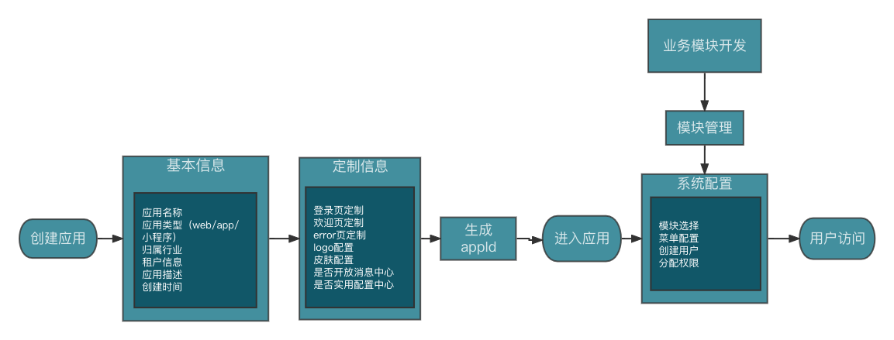
- 应用管理功能模型
  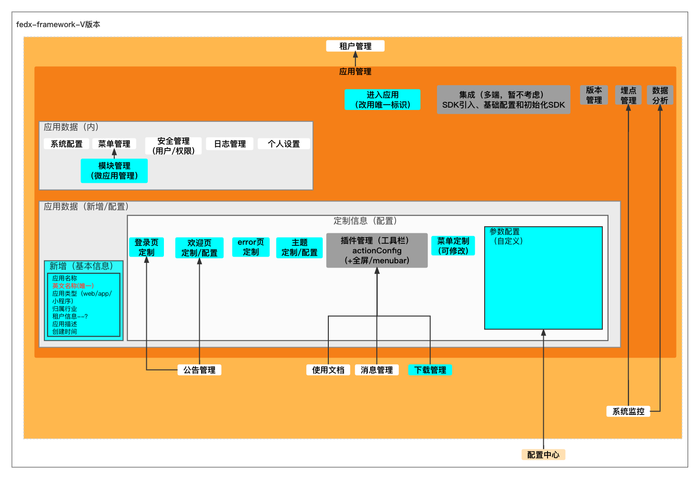
- 应用发布前,框架部署接入方案,目前仅支持以下两种:
  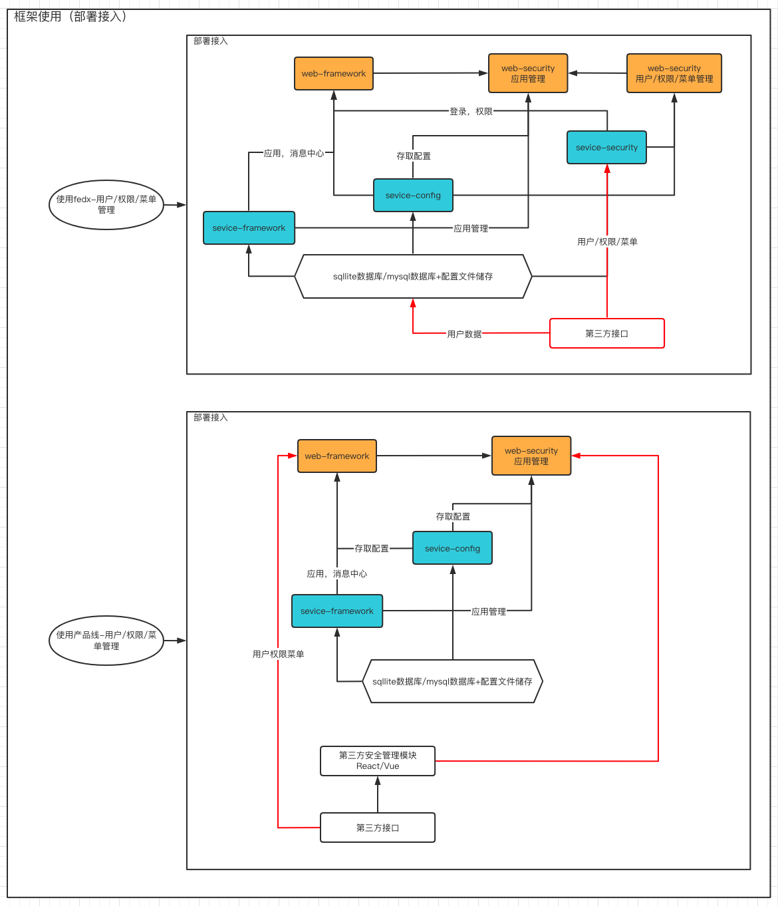

### **逻辑设计**

- 前端界面通过调用应用管理服务,对公告数据实现增删改查/定制信息/基本配置/发布访问等操作.
- bff层对应用相关数据进行操作.

### **功能及界面**

- 应用信息以列表方式呈现,支持以缩略图列表查看;展示应用基础信息,基础信息包含应用ID,应用名称,logo列(预览)等,与新增字段保持一致,列表根据最后更新时间倒序排列,支持根据以上条件快速查询.
  
- 应用基础信息在新增时填写
    1. 已有:应用名称/英文名称(唯一)/应用类型（web/app/小程序）/应用描述
    2. 需补充:归属行业(暂无)/租户信息(暂无)/最后更新时间(自动生成))/上传logo(logoName/logoPath/logoStyle/logoTitleColor)/系统名称(显示名)
    3. id由接口层自动分配生成,英文名称作为访问应用的唯一标识需要校验唯一性,创建/更新时记录时间
- 以步骤条为导航分步骤进行定制/配置
- 应用定制内容包含登录页定制,欢迎页定制,error页定制,主题定制,菜单定制,插件定制;
    1.登录页定制-配置中心loginConfigs
  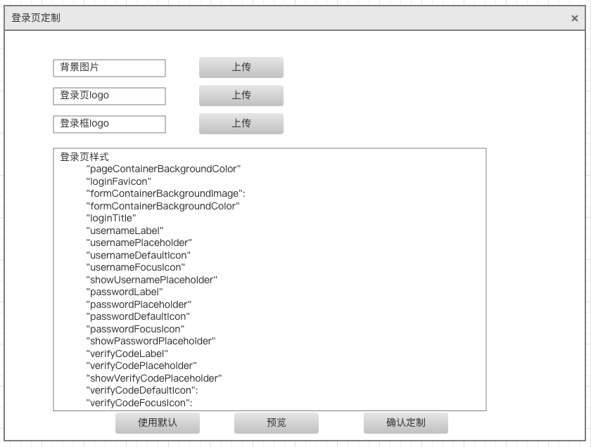
    2.欢迎页定制-欢迎页支持3种类型:图片/系统信息通告/指定页面-配置中心welcomePageConfig(需整合)
  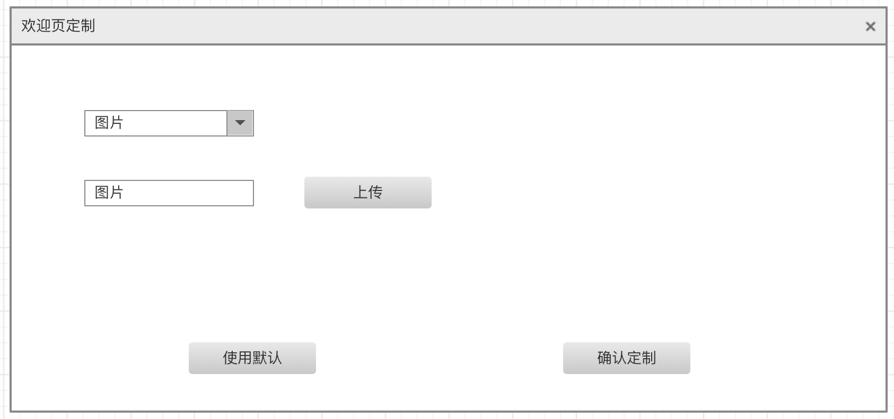
  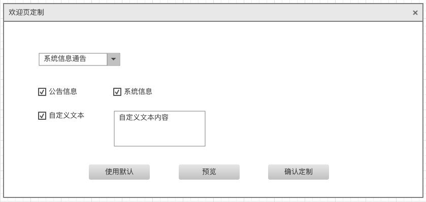
  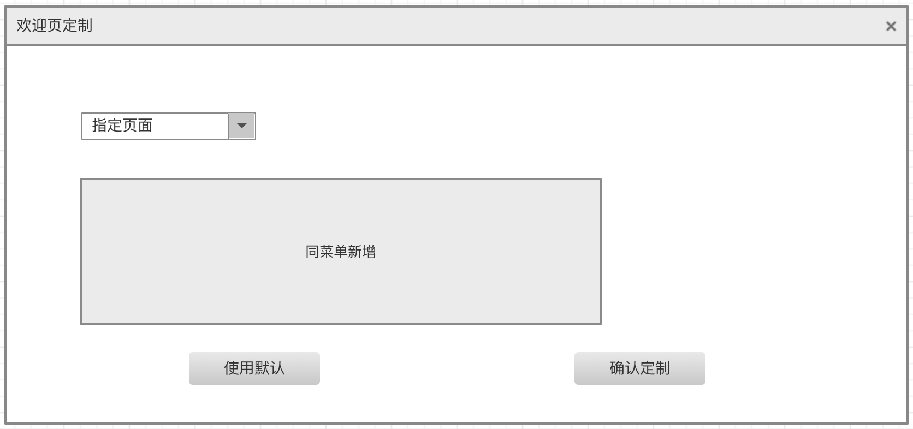
    3.error页定制-error页支持2种类型:图片/指定页面-配置中心errorPageConfig(待增加)
  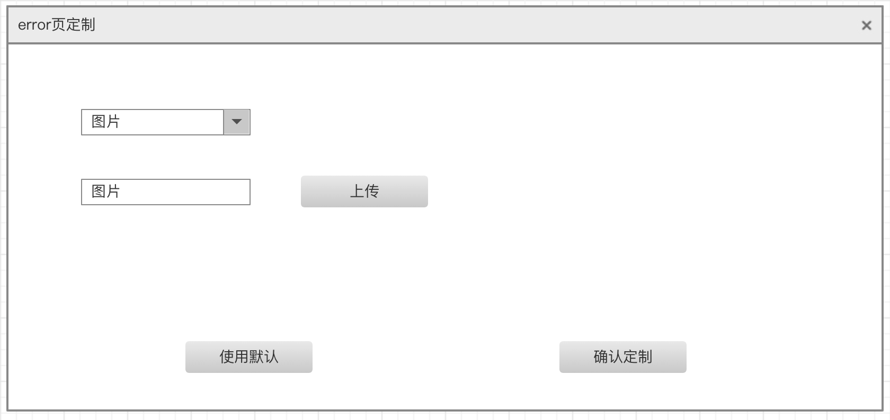
  
    4.主题定制-使用主题定制平台功能(<http://10.12.2.187:9011/web-theme/>),发布主题后下载文件(暂时需要oss-UI手动更新发布后生效)
  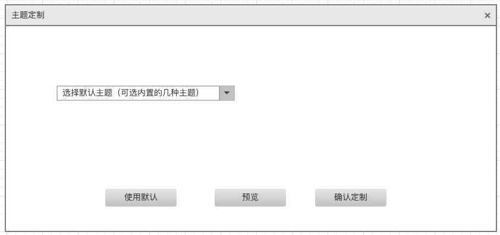
    5.菜单定制(页面参考功能角色管理-新增-功能选择,接口新增当前应用菜单)
  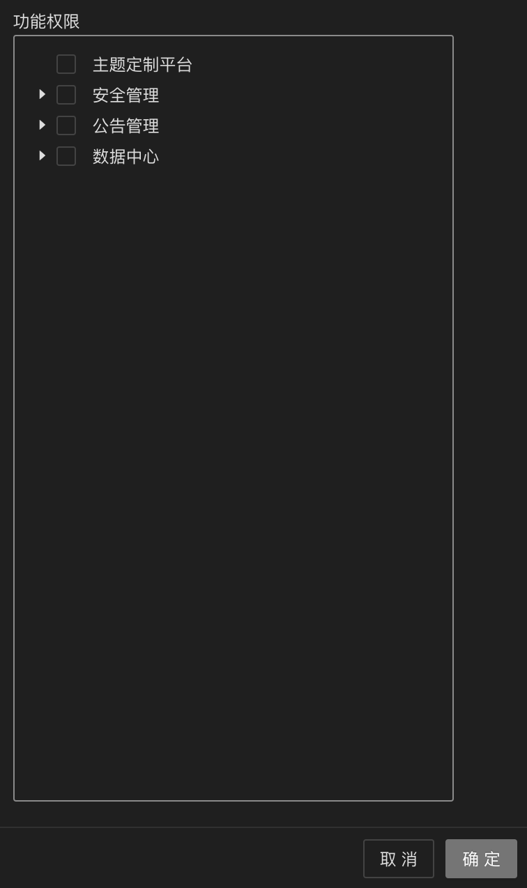

    6.插件定制-配置中心actionConfig(待整合)
  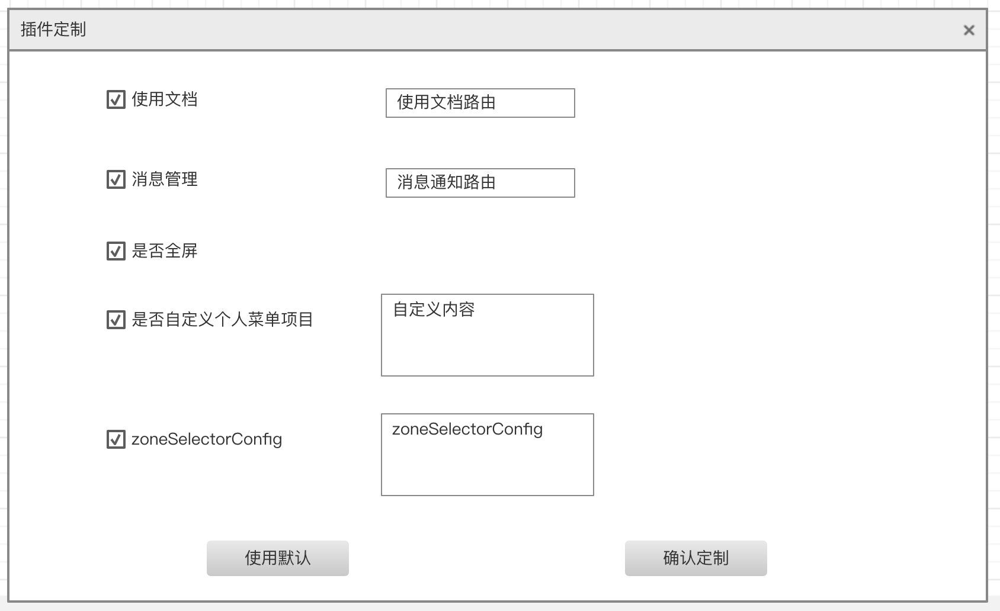
- 应用其他参数配置-说明参考<http://10.10.5.100:8090/pages/viewpage.action?pageId=5211090>,在上述步骤不进行定制的部分将使用文档中的默认配置
  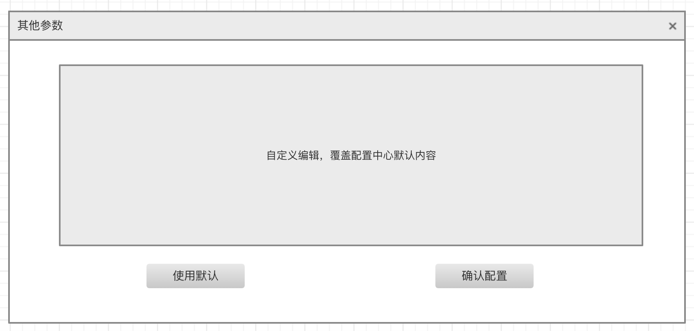

- 应用信息支持修改;
- 应用信息支持删除,删除前进行校验;
- 应用信息生成后,可查看详情(同新增修改,不可编辑),可跳转进入到应用系统界面进行基础设置(菜单配置,用户配置,权限分配等)
- 点击"进入应用"按钮,可跳转至应用,根据英文名称分配路由;应用内可修改内容:系统配置/菜单配置/用户信息/角色信息/个人设置
- 应用内记录日志时关联appId

### **接口设计**

- 接口文档:<http://10.10.2.8:9091/project/261/interface/api>
- 界面通过调用service-security服务提供的rest接口完成对应用信息的操作.
  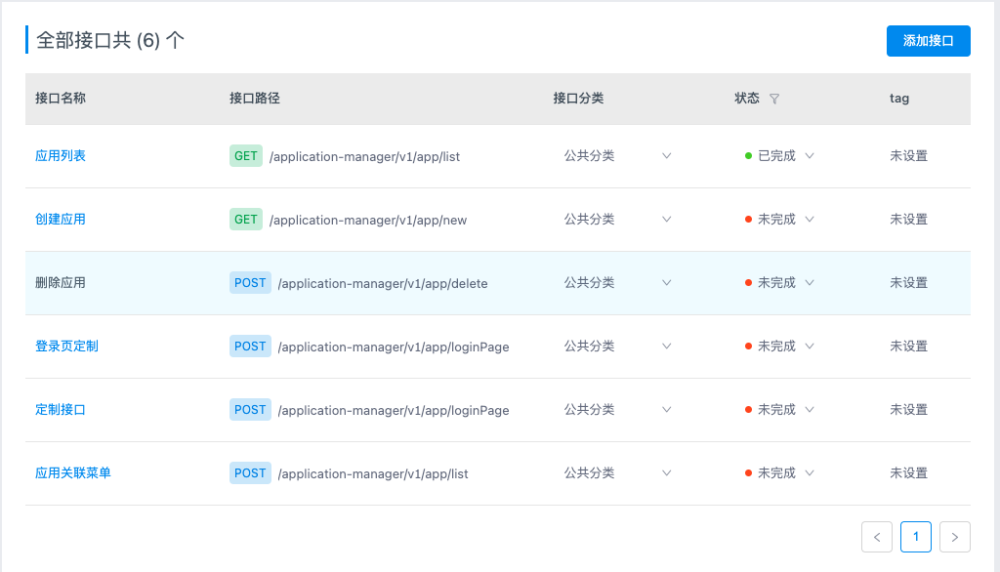
- 待补充/更新接口:
    1.新增校验
    2.基本信息模型字段
    3.配置中心项

## **性能,限制和约束**

- 点击查询.新增.修改.删除等操作界面呈现数据不得超过2s；
