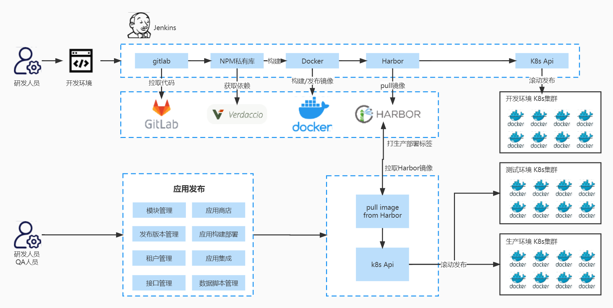
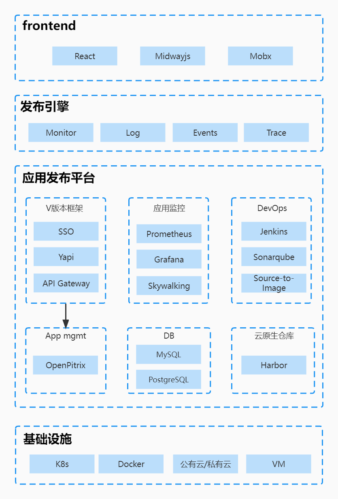

# web前端应用的容器化改造
提供全栈的 IT 自动化运维能力。

## 核心能力

- Kubernetes 多集群管理
    借助图形化 Web 控制台，用户可以管理底层的基础架构，例如添加或删除集群。
  - 独立：可以在平台中维护和管理独立部署的 Kubernetes 集群。
  - 联邦：多个 Kubernetes 集群可以聚合在一起作为 Kubernetes 资源池。当用户部署应用程序时，副本可以部署在资源池中的不同 Kubernetes 集群上。由此，跨区域和多集群实现了高可用性。

- 打造结合 Kubernetes 的 DevOps体系
    提供了基于 Jenkins 的可视化 CI/CD 流水线编辑，无需对 Jenkins 进行配置，同时内置丰富的 CI/CD 流水线插件，包括Binary-to-Image (B2I) 和Source-to-Image (S2I)，用于将源代码或二进制文件打包到准备运行的容器映像中。

    - 自动化：CI/CD 流水线和构建策略均基于 Jenkins，可简化和自动化开发、测试和生产过程。缓存依赖项用于加速构建和部署。
    - 开箱即用：用户可以基于他们的 Jenkins 构建策略和客户端插件来创建基于 Git repository/SVN 的 Jenkins 流水线。在内置的 Jenkinsfile 中定义任何步骤和阶段。支持常见的代理类型，例如 Maven，Node.js 和 Go。用户也可以自定义代理类型。
    - 可视化：用户可以轻松地与可视化控制面板进行交互，编辑、管理 CI/CD 流水线。
    - 质量管理：支持通过静态代码分析扫描来检测DevOps 项目中的 bug、代码错误和安全漏洞。
    - 日志：日志完整记录 CI/CD 流水线运行全过程。

- 云原生应用商店
    多集群功能与行业领先的应用程序管理平台 OpenPitrix 配合使用，使用户可以在整个生命周期内管理应用程序，包括发行、移除和分发。

- 云原生可观测性
    通过可视化界面操作监控、运维功能，可简化操作和维护的整个过程。它提供了对各种资源的自定义监控，并可以立即将发生的问题发送给用户。

## 云原生协作流程图

## 云原生技术架构图

