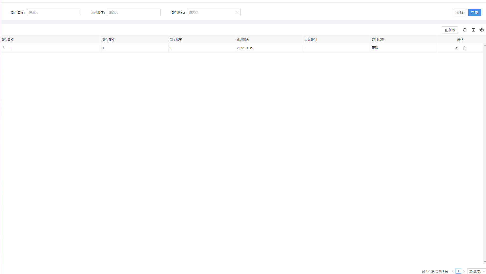
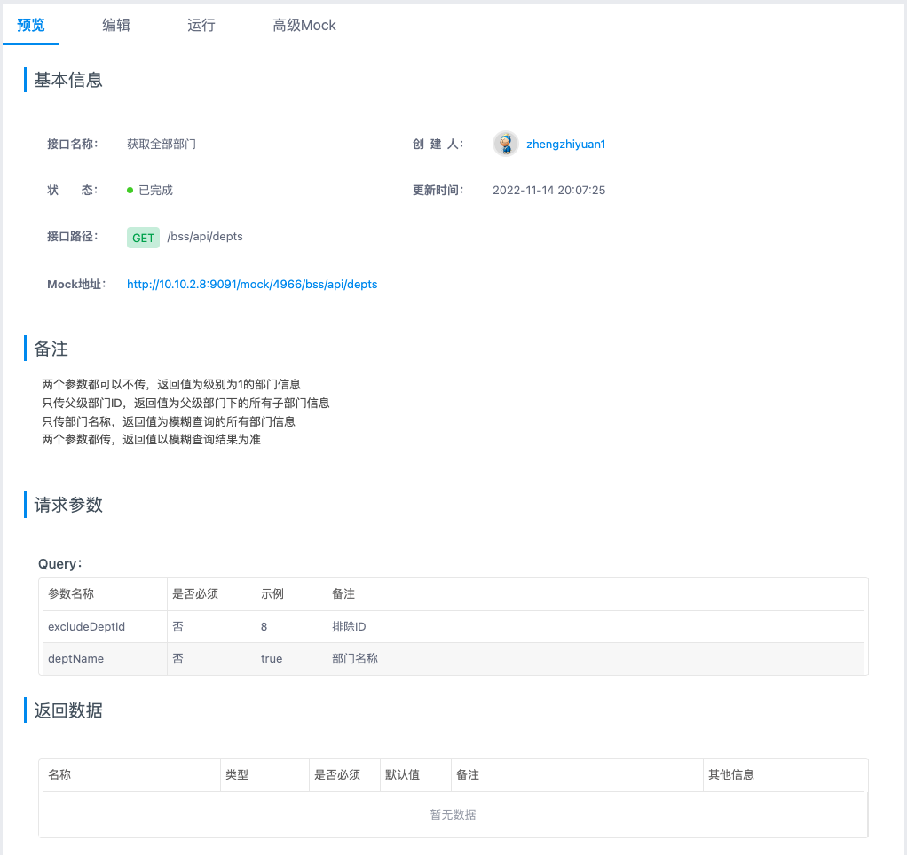
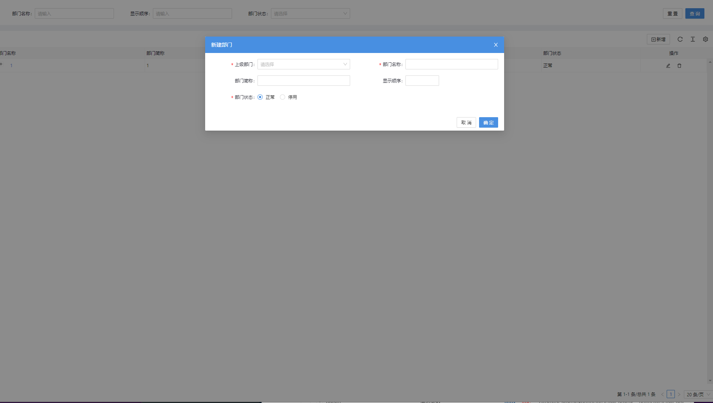
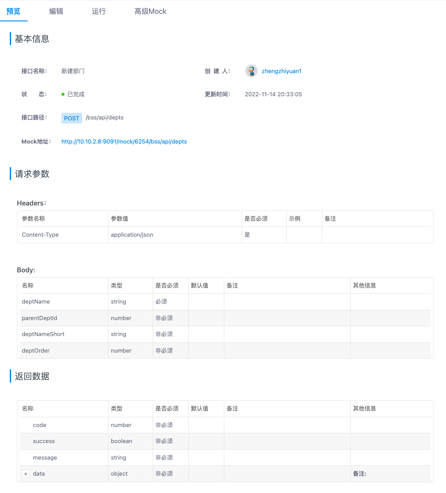
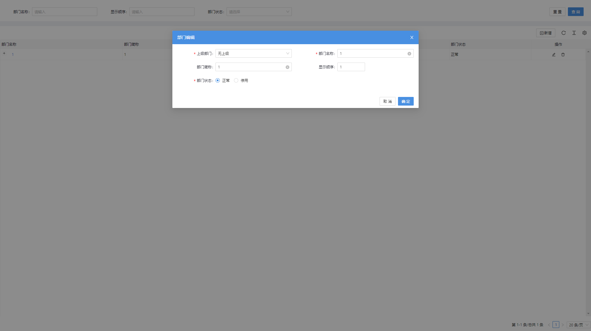
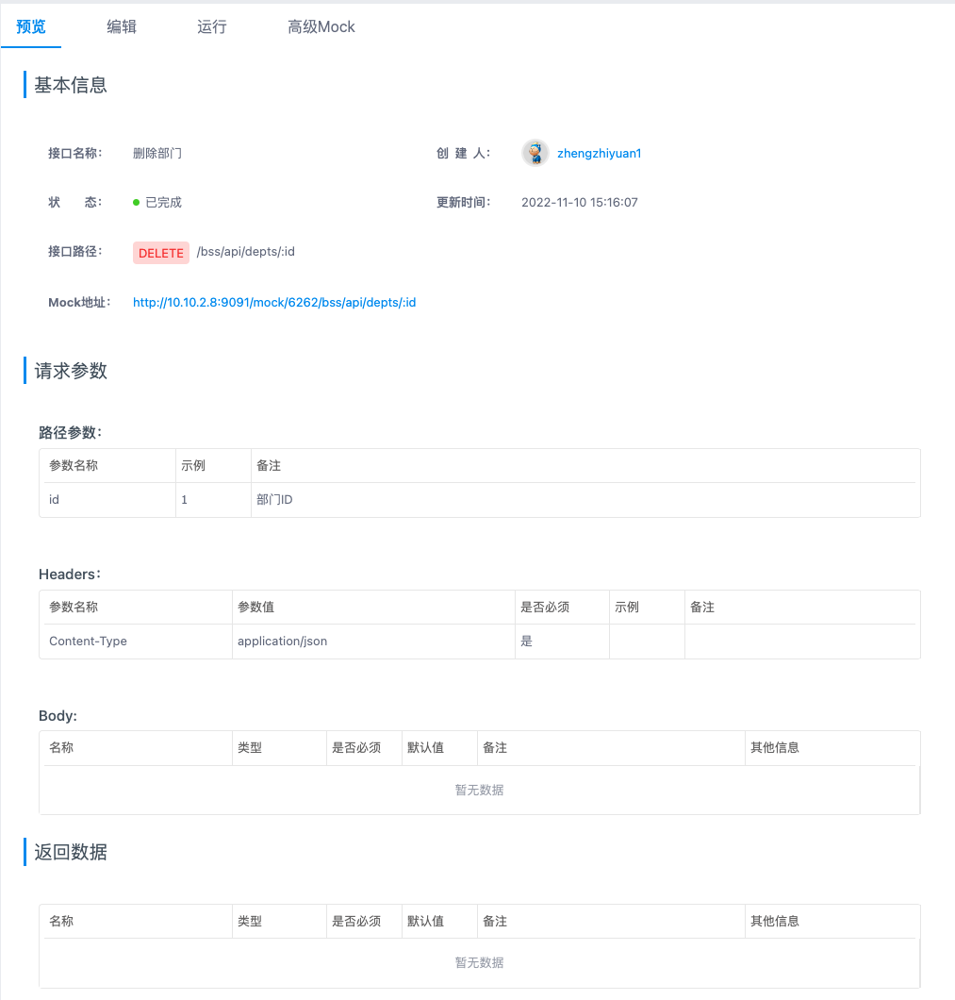
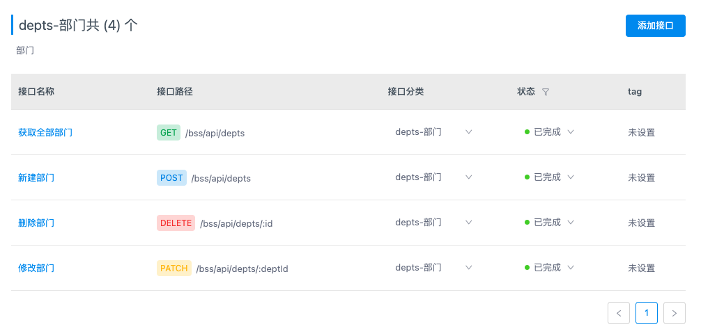

# [部门管理]()

## **功能简介**

  部门作为用户的分类管理信息使用,也拥有层级结构，操作大致和菜单一致，本章节不再做过多操作介绍。部门可以用于批量处理用户权限分配。

## **逻辑设计**

  处理逻辑:
    前端界面通过调用安全管理服务,对部门数据实现增删改查/用户关联等操作.
    bff层根据使用场景,支持直接连接数据库,和第三方接口调用两种方式对数据进行操作.

## **功能详述及界面设计**

    部门管理界面为列表形式;点击节点左侧+可以逐一展开/折叠;每条部门信息支持点击查看详情
  
  
  
  
    右侧列表可对于选中父节点下的子菜单进行增删改查
  
  
  
  
  
  

## **程序说明**

  1.界面通过调用service-security服务提供的rest接口完成对部门信息的操作,具体接口调用在上一章节已做描述.
  

## **数据库(或者模型)设计**

  -详见接口层架构

## **性能,限制和约束**

  1.点击查询.新增.修改.删除等操作界面呈现数据不得超过2s；
