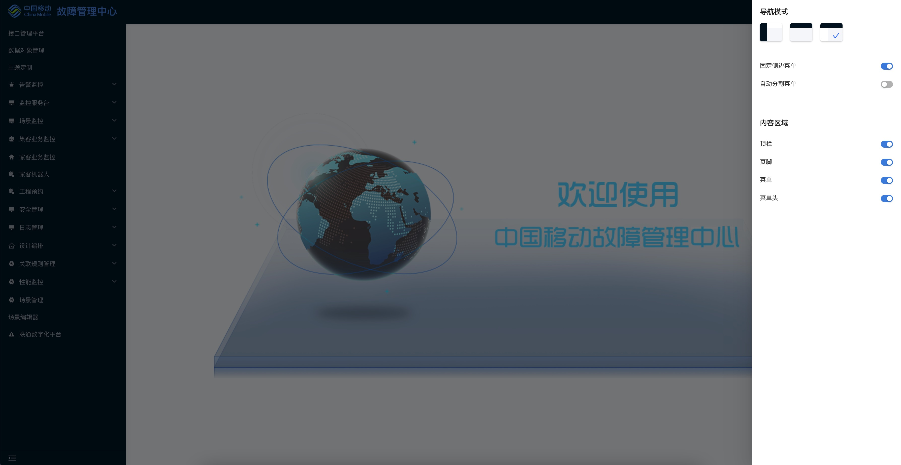
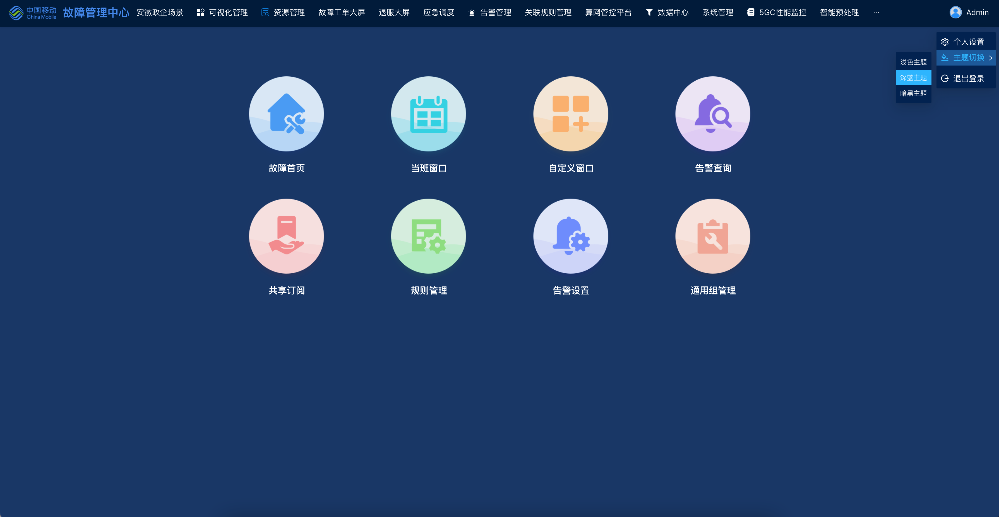
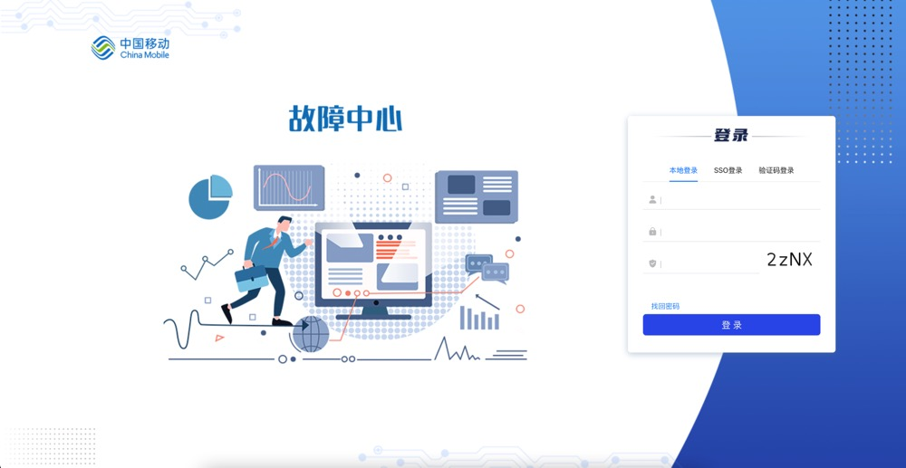

## 基础框架

### <a id="framework_base">框架基础能力</a>

- 完全响应式布局（支持电脑、平板、手机等所有主流设备）
- 强大的一键生成功能（包括控制器、模型、视图、菜单等）
- 支持按钮及数据权限，可自定义部门数据权限
- 国际化支持，服务端及客户端支持
- 完善的日志记录体系简单注解即可实现
- 支持服务监控，数据监控功能
- 支持多应用热插拔，应用间相互嵌套使用
- 支持主微应用数据消息共享，应用间相互通信
- 支持动态切换主题，一键换肤
- 支持消息中心，通知、消息、待办实时接收
- 支持系统配置，动态切换布局样式

  
  
  
  

### <a id="framework_config">核心配置</a>

```json
{
  "appId": 110002,
  "prefixCls": "oss-ui",
  "siderWidth": 250, // mix和side模式侧边菜单宽度
  "navTheme": "dark", // 菜单主题 可选dark和light
  /* 主题设置 */
  "themeConfig": {
    "theme": "light", // 默认主题色
    "showThemeSelector": true, // 是否展示主题切换器
    /* 主题切换列表 */
    "themeList": [
      { "key": "light", "name": "浅色主题" },
      { "key": "darkblue", "name": "深蓝主题" },
      { "key": "dark", "name": "暗黑主题" }
    ]
  },
  "layout": "top", // 布局模式 可选项为'top','side','mix','card','cardNav'
  "contentWidth": "Fluid",
  "fixedHeader": true,
  "fixSiderbar": true,
  "menu": { "locale": true, "defaultOpenAll": false },
  "headerHeight": 52, // 菜单栏高度
  "headerFontSize": 12, // 菜单栏文字尺寸
  "title": "故障管理中心", // 项目标题
  "description": "测试描述测试描述",
  "iconfontUrl": "", // iconfont路径
  "logo": "/images/default-logo.jpg", // logo路径
  "logoMin": "/images/default-logo-min.png", // 折叠后的小logo路径
  "logoStyle": {}, // logo的样式
  "logoTitleColor": "", // logo文字的颜色
  "defaultUrl": "/",
  "welcomeImageUrl": "/images/welcomeAndError/welcome.png", // 欢迎页图片路径
  /* 自定义欢迎页配置 */
  "welcomePageConfig": {
    "enable": false, // 是否启用
    "entry": "http://localhost:9005/security/power-admin-manage", // entry路径（不可以是主应用的路径）,需为完整路径，如果值存在则protocol、hostname、port、path均失效
    "module": "oss-security-manager", // module （必填）
    "curRoute": "/security/power-admin-manage", // 当前路由（和path二选一必填）
    "protocol": "http:", // 协议
    "hostname": "localhost", // 域名
    "port": 3000, // 端口
    "path": "/data-center/data-object-management" // 路径（和curRoute二选一必填）
  },
  /* 鉴权配置 */
  "authorizeConfig": {
    "authorize": true, // 是否启用鉴权
    "authorizeUrl": "http://10.12.2.187:7001", // 鉴权路径
    "ssoUrl": "http://10.12.2.187:9011/ssoUrl", // 登录地址
    "timeout": 20000, // 超时时间
    "anonymousUrls": [],
    "refreshTime": 600000, // 刷新token时间间隔
    "clientId": "oss-framework",
    "clientSecret": "boco",
    /* 第三方登出接口配置 */
    "externalLogout": {
      "externalLogoutUrl": "xxx/token/blacklist",
      "params": {
        "exp": "${timestamp}",
        "jti": "${thirdpart_access_token}"
      },
      "method": "post"
    },
    "confirmBeforeLogout": false // 退出登录确认提示
  },
  /* 日志设置 */
  "logConfig": {
    "logUrl": "http://10.12.2.187:7001",
    "level": "debug"
  },
  /* 菜单配置 */
  "contextmenuConfig": {
    "menuUrl": "contextmenu.json"
  },
  "maxTabsCount": 15, // 最大tab页数量
  /* 菜单栏按钮配置 */
  "actionConfig": {
    /* 工具栏配置 */
    "toolbarConfigs": [
      {
        "key": "help",
        "title": "使用文档",
        "actionMode": "blank",
        "entry": "https://www.baidu.com",
        "icon": "QuestionCircleOutlined",
        "isShow": false,
        "params": {}
      }
    ],
    /* 消息中心配置 */
    "noticeConfig": {
      "isShowNotice": true,
      "noticeWsUrl": "ws://10.10.2.8:7006",
      "noticeUrl": "http://10.10.2.8:7006",
      /* 消息类型配置 */
      "noticeList": [
        {
          "key": "notification",
          "title": "通知",
          "emptyText": "你已查看所有通知"
        },
        {
          "key": "message",
          "title": "消息",
          "emptyText": "你已读完所有消息"
        },
        {
          "key": "event",
          "title": "待办",
          "emptyText": "你已完成所有待办"
        }
      ]
    },
    /* 全屏配置 */
    "fullScreenConfig": {
      "isShowFullScreen": true // 是否展示全屏按钮
    },
    /* 头像下拉框按钮栏配置 */
    "menubarConfigs": [
      {
        "key": "ruleAdmin",
        "title": "关联规则管理后台",
        "actionMode": "self",
        "entry": "/?appId=12301",
        "icon": "HomeOutlined",
        "isShow": true,
        "params": {}
      }
    ]
  },
  "entryPagePath": "", // 登录默认打开路径（优先级高于欢迎页和自定义欢迎页）
  "useMenuManage": false, // 是否使用菜单管理
  "showVersion": true, // 是否开启版本更新提示
  /* 记录在线状态接口设置 */
  "recordOnlineTime": {
    "enable": false, // 启用
    "timeout": 10000, // 接口调用间隔
    "onlineUrl": "http://xxx.aaa/bbb", // 接口地址
    "method": "get" // 接口类型
  },
  "userSettingConfig": {
    "hideModifyPassword": false // 隐藏修改密码页面
  }
}
```

### <a id="framework_theme">主题定制平台</a>

- 支持在线定制主题,通过可视化界面操作可以快速搭建新的主题皮肤，一件下载配置，导入到系统中即可快速使用。
  

### <a id="framework_login">登录页定制</a>

- 支持通过 json 配置属性以及配置 css 样式，非常灵活的配置登录页样式布局。
- 示例：
  - 移动登录页 
  - 可视化平台登录页 
  - 联通登录页 
- 配置说明

```json
{
  "apiBaseUrl": "http://10.10.2.8:7001", //鉴权服务地址+端口
  /* 样式配置 */
  "styleConfig": {
    /* 配置名称 */
    "default": {
      "loginPageContainerImg": "/login/default/background.png", //整体页面的背景图片
      "loginPageContainerLogo": "/login/default/container-logo.png", //页面LOGO
      "loginFormContainerLogo": "/login/default/logo.png", //表单上方LOGO
      /* 页面LOGO样式，行内样式为CSS属性 */
      "loginPageLogoStyle": {
        "width": "400px",
        "top": "14%",
        "left": "7%"
      },
      "loginPageDecorate": "/login/default/container-decorate.png", //整体页面装饰图，覆盖到背景图片上方
      /* 页面装饰图样式，行内样式为CSS属性 */
      "loginPageDecorateStyle": {
        "top": "50%",
        "transform": "translate(-50%, -50%)",
        "left": "38%"
      },
      "loginFormContainerColorTheme": "dark", //表单框内样式主题：（dark/light）控制字体颜色
      /* 表单框定位参数，可传入其他css样式 */
      "loginFormContainerPosition": {
        "right": "7%"
      },
      "pageContainerBackgroundColor": "rgb(36, 45, 103)", //整体页面背景颜色
      "loginFavicon": "/OSS.svg", //浏览器图标
      "formContainerBackgroundImage": null, //表单框内背景图片
      "formContainerBackgroundColor": "rgba(69,75,113,0.4)", //表单框内背景颜色
      "loginTitle": "鉴权登录", //页面标题
      "usernameLabel": "账号", //用户名栏内显示文字
      "usernamePlaceholder": "请输入用户名/邮箱", //用户名栏内提示文字
      "usernameDefaultIcon": "iconzhanghao-3-2", //用户名栏内默认显示图标
      "usernameFocusIcon": "iconzhanghao-3", //用户名栏内聚焦图标
      "showUsernamePlaceholder": false, //是否展示用户名栏内提示文字
      "passwordLabel": "密码", //密码栏（字段介绍如上所示）
      "passwordPlaceholder": "请输入密码",
      "passwordDefaultIcon": "iconmimabeifen-3",
      "passwordFocusIcon": "iconmimabeifen-3-2",
      "showPasswordPlaceholder": false,
      "verifyCodeLabel": "验证码", //验证码栏（字段介绍如上所示）
      "verifyCodePlaceholder": "请输入验证码",
      "showVerifyCodePlaceholder": false,
      "verifyCodeDefaultIcon": "iconyanzhengma-3",
      "verifyCodeFocusIcon": "iconyanzhengma-3-2",
      "focusInputHideInputPrefixLabel": true, //聚焦的时候是否显示前缀（默认为显示）
      "findPasswordByMobileButton": true //是否展示找回密码按钮
    }
  },
  "stylePackageName": "default", // 当前使用的样式配置名称(在styleConfig中配置)
  "captchaCountdown": 5, //nubmer类型 找回密码验证码倒计时
  /*  登录方式配置  只有两种 默认 / frame    如果是frame  需要配置src和id 。都需要配置标题   可以配置 内容的类型（contentType）  增加："verify-code" 验证码登录方式 */
  "loginPage": [
    {
      "tabTitle": "本地登录"
    },
    {
      "tabTitle": "SSO登录",
      "isFrame": true,
      "frameSrc": "http://sso.gmcc.net/?client_id=cnms_gmcc_net&amp;returnUrl=http://cnms.gmcc.net/SMonitor/ssoCheck.aspx",
      "frameId": "loginIframe"
    }
  ]
}
```
