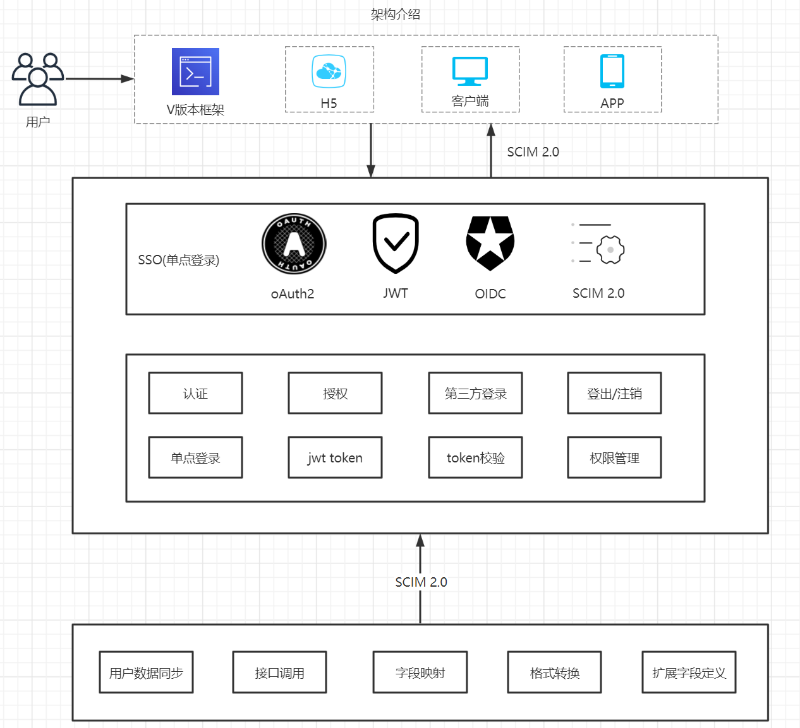
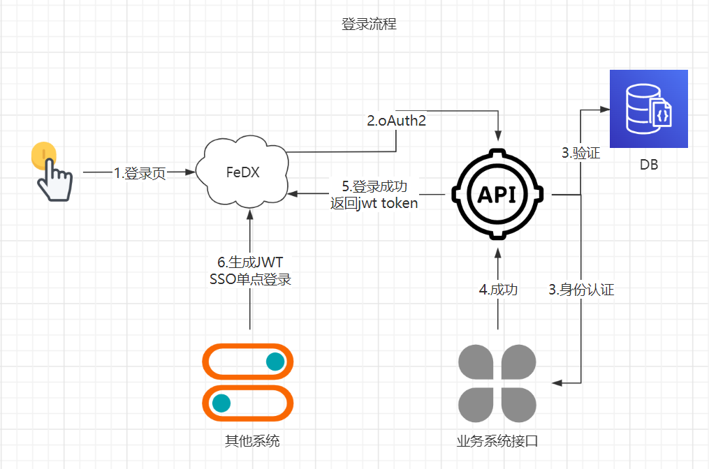
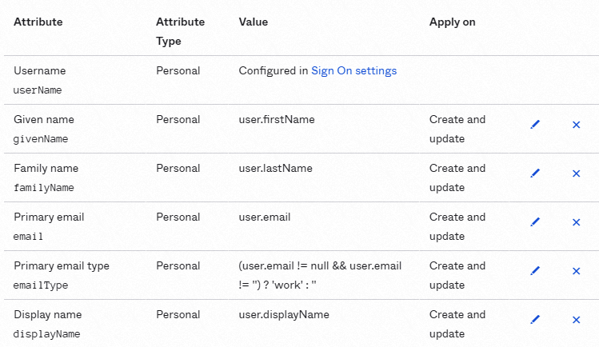
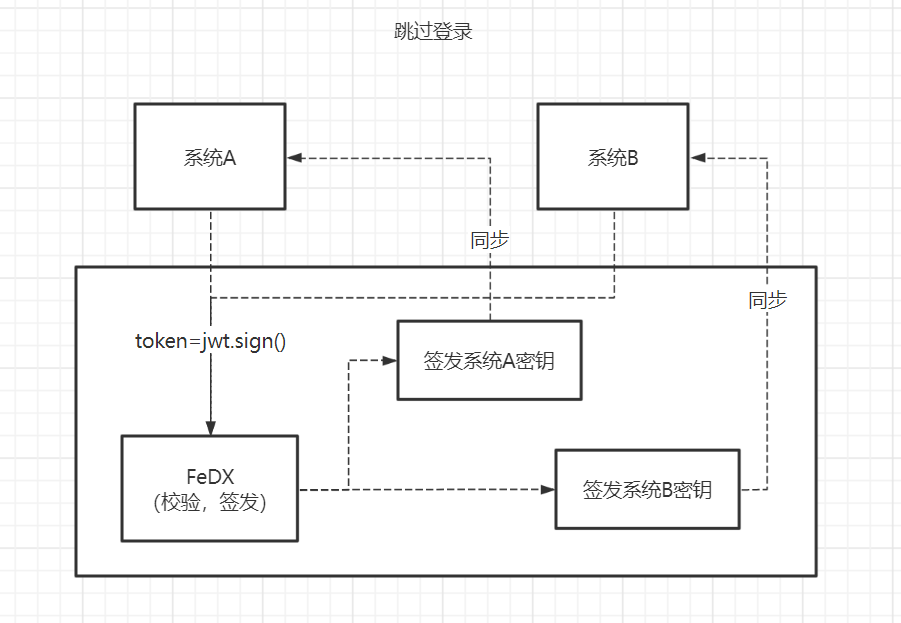

# 技术架构图




# 接口层基础介绍

V版本接入层提供V版本框架登录所需的功能，该部分与V版本框架独立。在使用V版本时，无需开发支持直接使用基础API功能，也可根据接口规范对接口进行扩展，同时V版本接口层提供数据编排能力，支持其他已有系统通过配置快速接入V版本功能。为了适配第三方系统（例如：沃运维平台）的单点登录与嵌入，V版本接入层提供规则对登录进行跳过，实现无感知登录。

## 名词释义  

**oAuth2.0**  

用户通过V版本接入层完成系统登录，V版本接入层主要基于OAuth 2.0协议实现SSO(单点登录)功能，支持第三方系统接入。对外接口一致使用REST+JSON方式，方便各种客户端各种语言灵活调用。  

oAuth2.0提供四种授权模式，接口层目前采用授权码模式  
- 授权码(Authrization Code)模式
- 隐式/简化(Implicit)模式
- 密码(Resource Owner Password)模式
- 客户端(Client)模式  

授权码模式的优点是比较安全，他可以有token过期时间，而且上面的第四和第五步都是在服务器之间的访问，很难被截获，用户信息也存在服务端，这样就保证了他的安全性。他的缺点是需要进行多次请求才能访问到资源。
授权码模式假定资源拥有者和客户不在一台设备上，他拥有高安全性的保障，目前市面上主流的第三方认证都是采用这种模式。


**JWT**  

JWT(JSON Web Token)目前是应用最广的接口权限方案，具有无状态,跨系统,多语言多平台支持等特点，统一由网关进行JWT token 校验。在网关层实现JWT验证可以完全避免代码入侵并且为整个接口校验提供统一的解决方案。

jwt核心功能点，secret由接入层根据第三方系统统一提供
```
生成jwt示例：jwt.sign({"userId":"xxxxxxx"}, secret);
校验jwt示例：jwt.verify(token, secret) ;
```  

**Scim2.0**  
SCIM由通用用户和组方案以及扩展模型的概念提供支持。 它不仅仅促进了这样的方案，而且也使用标准协议交换这些方案的有约束力的合约，这使得SCIM成为开放的连接器。 下图说明了SCIM 2.0的对象模型。 如下所示，Resource是共同特性，所有SCIM对象都是从它派生的。 资源具有id，externalId和meta作为属性， RFC7643定义了扩展公共属性的User，Group和EnterpriseUser。SCIM规范提供了简单的REST API，其集合操作功能去打足以执行大批量更新。  
 

## 接入流程规范

  

### 普通登录流程
#### 流程介绍  
V版本接入层为适配业务系统，接入层自身遵循Scim2.0规范，如果外部系统支持Scim2.0规范，接入层可根据Scim2.0协议的规范进行配置，快速完成集成。在使用V版本框架时，首先接入层支持oAuth2.0规范结合Jwt生成符合规则的token内容。在适配外部系统接口时，提供请求参数转换+接口调用+返回值参数转换的流程定义，满足接入要求。

如图所示，普通登录流程：  
 


#### 参数转换能力  
##### 转换器编辑
为了对业务系统原有接口做到最小化变更，接入层提供在线代码编辑能力，对请求参数进行转化，无需变更业务系统接口，接入层无需开发，发布，部署，即可替换原有登录功能。
 

##### 预配能力  
对不支持Scim2.0规范的应用，接入层提供支持配置功能，可进行字段映射配置与在线转换器编辑能力。启用字段映射后，可以将应用程序设置为从中导入用户配置文件的“源”或向其发送属性的“目标”。V版本将返回值按照Scim2.0规范进行转换。  
V版本使用配置文件编辑器将特定用户属性从接入应用程序映射到V版本。不同的身份提供方支持不同的字段作为映射标识，您可以根据业务需求设置其中一个作为映射标识。您也可以不设置或取消设置。
 

### 第三方系统跳过登录
V版本接入层为外部系统提供了跳过登录的能力，但前提是双方账号登录名一致。第三方系统可根据V版本要求的规则，生成JWT的一个token值，将token传给V版本进行校验。每个三方系统使用的密钥均由接入层根据三方系统地址提供，V版本将根据三方系统的域名路由和密钥进行token验证，防止恶意跳转。  

如图所示：  
 


## 接入规范  

### 内部接口规范  
#### 介绍
接入层对内接口为V版本基础接口，可基于此接口标准进行扩展或重定义，接口文档可参见下面描述  

- 登录鉴权  
功能描述：提供用户基本的登录权限功能，可根据第三方接口进行动态调整  
接口定义：http://10.10.2.8:9091/project/267/interface/api
-  应用管理  
功能描述：V版本将根据不同的应用ID，保存相关信息。例：登录页配置信息，系统名称，系统Logo，系统Icon。  
接口定义：http://10.10.2.8:9091/project/261/interface/api
- 用户管理  
功能描述：用于管理用户列表数据，提供默认的基础字段，支持扩展字段自定义。提供在线用户数据，监控当前系统中活跃用户  
接口定义：http://10.10.2.8:9091/project/255/interface/api
- 菜单管理  
功能描述：为框架提供菜单维护的接口，根据不用的应用，返回不同的菜单  
接口定义：http://10.10.2.8:9091/project/255/interface/api
- 权限管理  
功能描述：管理按钮权限的相关接口  
接口定义：http://10.10.2.8:9091/project/255/interface/api
- 角色管理  
功能描述：角色菜单权限分配、设置角色按机构进行数据范围权限划分。  
接口定义：http://10.10.2.8:9091/project/255/interface/api
- 部门管理  
功能描述：配置系统组织机构（公司、部门、小组），将部门进行树结构展现。  
接口定义：http://10.10.2.8:9091/project/255/interface/
- 日志管理  
功能描述：记录操作日志，系统正常操作日志记录和查询，系统异常信息日志记录和查询。
记录登录日志，系统登录日志记录查询包含登录异常。  
接口定义：http://10.10.2.8:9091/project/258/interface/api


### 外部接口要求
#### 介绍
接入层对外提供数据转换能力，V版本遵循scim2.0规范，可快速接入外部系统。同时接入层对于不遵循scim2.0规范的外部接口，提供转换能力，由V版本进行接口调用，通过字段映射的方式将外部接口返回值转换为scim2.0规范  


#### 接入接口要求

1. 用户校验接口
接入层需要校验第三方用户名和密码，需要第三方提供校验接口，接口需要提供用户名和密码的登录校验，字段名称可随意变更。  

 

2. 获取用户信息  
要求可根据用户id返回用户相关信息，参考示例  

 

3. 用户菜单权限接口
要求可根据用户id返回用户菜单权限列表。 

 


4. 用户按钮权限接口  
要求可根据用户ID返回该用户所拥有的按钮权限列表，外部系统提供一个获取用户按钮权限列表的接口，以下为参考示例。  

 
