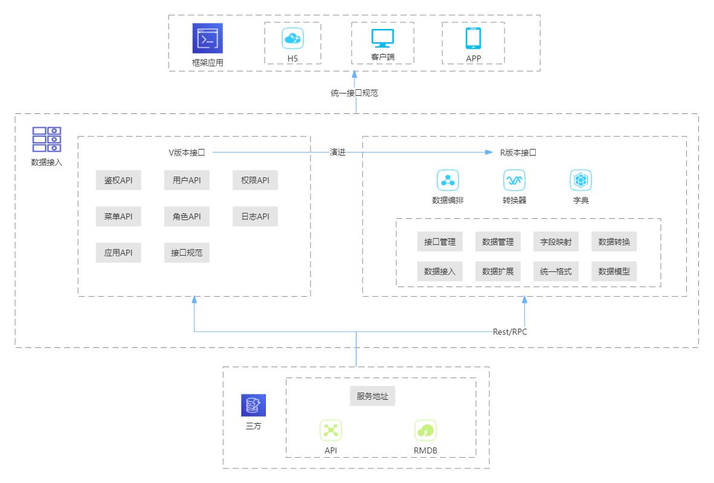

# 技术架构图




# 接口层基础介绍

## 基础能力
### 1.介绍
`V版本接口层` 提供V版本应用的基础API，该部分与V版本框架独立。在使用V版本时，无需开发支持直接使用基础API功能，也可根据接口规范对接口进行扩展，同时V版本接口层提供数据编排能力，支持其他已有系统通过配置快速接入V版本功能
### 2.优点
- 接入更简单：只需进行配置，完成框架接入
- 开发更简单：按照接口规范进行自定义开发
- 流程更简单：V版本接口支持多种接入方式

### 3.接口规范地址
http://10.10.2.8:9091/group/181


## 对内接口

- 登录鉴权  
功能描述：提供用户基本的登录权限功能，可根据第三方接口进行动态调整  
接口定义：http://10.10.2.8:9091/project/267/interface/api
-  应用管理  
功能描述：V版本将根据不同的应用ID，保存相关信息。例：登录页配置信息，系统名称，系统Logo，系统Icon。  
接口定义：http://10.10.2.8:9091/project/261/interface/api
- 用户管理  
功能描述：用于管理用户列表数据，提供默认的基础字段，支持扩展字段自定义。提供在线用户数据，监控当前系统中活跃用户  
接口定义：http://10.10.2.8:9091/project/255/interface/api
- 菜单管理  
功能描述：为框架提供菜单维护的接口，根据不用的应用，返回不同的菜单  
接口定义：http://10.10.2.8:9091/project/255/interface/api
- 权限管理  
功能描述：管理按钮权限的相关接口  
接口定义：http://10.10.2.8:9091/project/255/interface/api
- 角色管理  
功能描述：角色菜单权限分配、设置角色按机构进行数据范围权限划分。  
接口定义：http://10.10.2.8:9091/project/255/interface/api
- 部门管理  
功能描述：配置系统组织机构（公司、部门、小组），将部门进行树结构展现。  
接口定义：http://10.10.2.8:9091/project/255/interface/
- 日志管理  
功能描述：记录操作日志，系统正常操作日志记录和查询，系统异常信息日志记录和查询。
记录登录日志，系统登录日志记录查询包含登录异常。  
接口定义：http://10.10.2.8:9091/project/258/interface/api


## 对外能力
### 介绍
`接口层对外提供适配能力，转换能力，根据配置无缝对接多个系统`  

使用原有系统接口，接口层将接口接入，并完成基础数据与扩展数据的转换


# 接口层核心功能
## 统一规范
统一的接口规范无论对前端还是后端都比较重要。为了解决这个问题，接口层对外提供统一的规范，R版本使用者可根据规范完成相关能力的开发
规范内容：
```
{
    code:0/1/2
    message:'提示信息'
    messageVisible:true/false
    data:{}
}
```

## 字段映射+数据转换+数据拓展
在接入第三方接口时，接入层支持对字段进行映射关系关联。将不满足基础数据格式的数据进行字段映射处理，转换为实际需要的返回值格式，通过转换器与字典，对数据进行修改。接入层将数据分为基础数据和扩展数据，基础数据为V版本框架提供默认能力的数据。在此基础上，增加扩展数据，满足R版本所需数据


## 用户数据规范样例
用户信息规范示例
```
{
    "userId": "1",
    "loginId": "admin1",
    "userName": "super admin",
    "userStatus": "锁定",
    "createTime": "2022-11-09T01:18:28.000Z",
    "userEmail": "admin@boco.com.cn",
    "userMobile": "17333333333",
    "deptId": "1",
    "deptName": "1"
}
```

R版本原始数据
```
{
    "id": "2819c223-7f76-453a-919d-413861904646",
    "loginName": "Jensen",
    "realName": "super Jensen",
    "status": 1,
    "createTime": "2022-11-09T01:18:28.000Z",
    "email": "Jensen@boco.com.cn",
    "userMobile": "17333333333",
    "deptId": "1",
    "deptName": "1",
    "zoneId":"110",
    "zoneName":"北京",
}
```


R版本 -> V版本代码转换==方案描述==
```
{
    "userId": {
        "key":"id",
        "primary": true
    },
    "loginId": {
        "key":"loginName"   
    },
    "userName": {
        "key":"loginName"   
    },
    "userStatus": {
        "key":"status",
        "dic":"userStatusDic"
    },
    "createTime":{
        "key":"create"
    },
    "userEmail": {
        "key":"email"
    },
    "userPhone": "17333333333",
    "deptId": "1",
    "deptName": "1"
}
```

用户信息示例
```
{
    "userId":"2819c223-7f76-453a-919d-413861904646",
    "loginId": "Jensen",
    "userName": "super admin",
    "userStatus": "锁定",
    "createTime": "2022-11-09T01:18:28.000Z",
    "userEmail": "Jensen@boco.com.cn",
    "userMobile": "17333333333",
    "deptId": "1",
    "deptName": "1",
    "ExtendField":{
        "zoneId":"1111",
        "zoneName":"区域名称",
        }
}
```