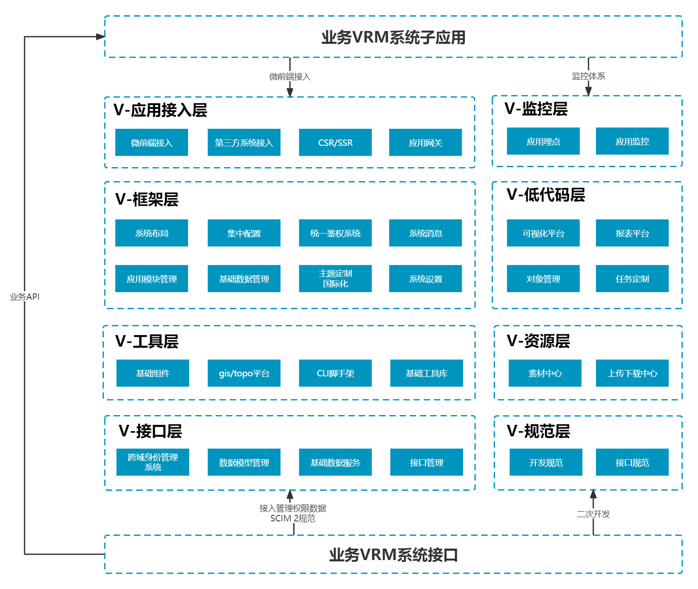

## **项目简介**

- FeDX-framework是一套对于后台管理系统提供的前端快速开发平台。内置了很多管理后台常用的业务模块，让开发者能专注业务，快速开发项目管理后台，极大地提高开发的速度.

## **主要特性**

- 完全响应式布局（支持电脑.平板.手机等所有主流设备）
- 强大的一键生成功能（包括控制器.模型.视图.菜单等）
- 支持多数据源，简单配置即可实现切换
- 支持按钮及数据权限，可自定义部门数据权限
- 对常用插件进行二次封装，使代码变得简洁，更加易维护
- 多项目依赖，模块及插件分项目，尽量松耦合，方便模块升级和增减模块
- 国际化支持，服务端及客户端支持
- 完善的日志记录体系，简单注解即可实现
- 支持服务监控，数据监控，缓存监控功能。
- 支持加载动态权限菜单，多方式轻松权限控制
- 高效率开发，所见即所得

## **内置功能**

1. 用户管理：用户是系统操作者，该功能主要完成系统用户配置。
2. 部门管理：配置系统组织机构（公司.部门.小组），树结构展现支持数据权限。
3. 角色管理：角色菜单权限分配.设置角色按区域级别进行数据范围权限划分。
4. 菜单管理：配置系统菜单权限标识等。
5. 权限管理：配置操作权限，按钮权限标识等
6. 租户管理: 租户是平台中拥有资源使用权限的实体，租户可以拥有多种资源，租户之间资源彼此隔离。
7. 应用管理: 应用定制及发布.应用权限租户的维度进行隔离。
8. 消息中心: 系统提示/通知/公告信息发布维护。
9. 日志管理: 系统正常操作日志记录和查询,系统异常信息日志记录和查询;登录日志,系统登录日志记录查询包含登录异常;系统监控.
10. 主题定制: 技术上支持灵活的样式定制,以满足业务应用上多样化的视觉需求,包括但不限于全局样式和指定组件的视觉定制,以及布局风格等。
11. 国际化: 从产品中抽离所有地域语言，国家/地区和文化相关的元素。应用程序的功能和代码设计考虑在不同地区运行的需要，支持切换.
12. 配置中心: 对系统动态配置常用参数。
13. 素材中心: 提供素材管理方案,用于支撑目标客户私有化部署要求.
14. 物料中心: 对于前端组件进行管理,团队成员可以共享，维护和同步来自不同项目的隔离组件,简化了UI组件上的协作过程。
15. 低代码平台: 以灵活高效为目标,以配置代替编码，实现大屏.首页类应用的交付。
