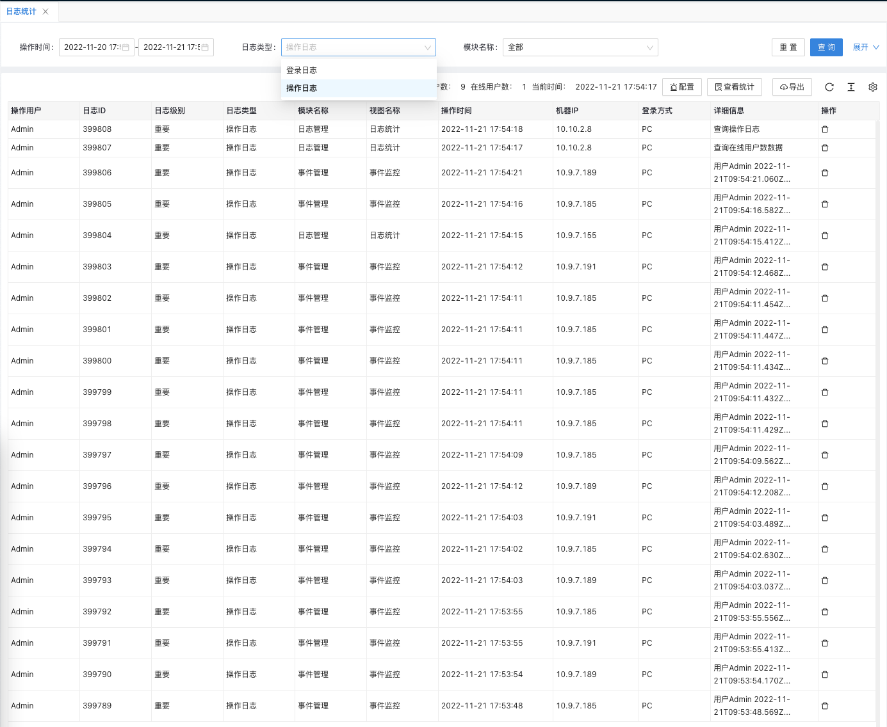
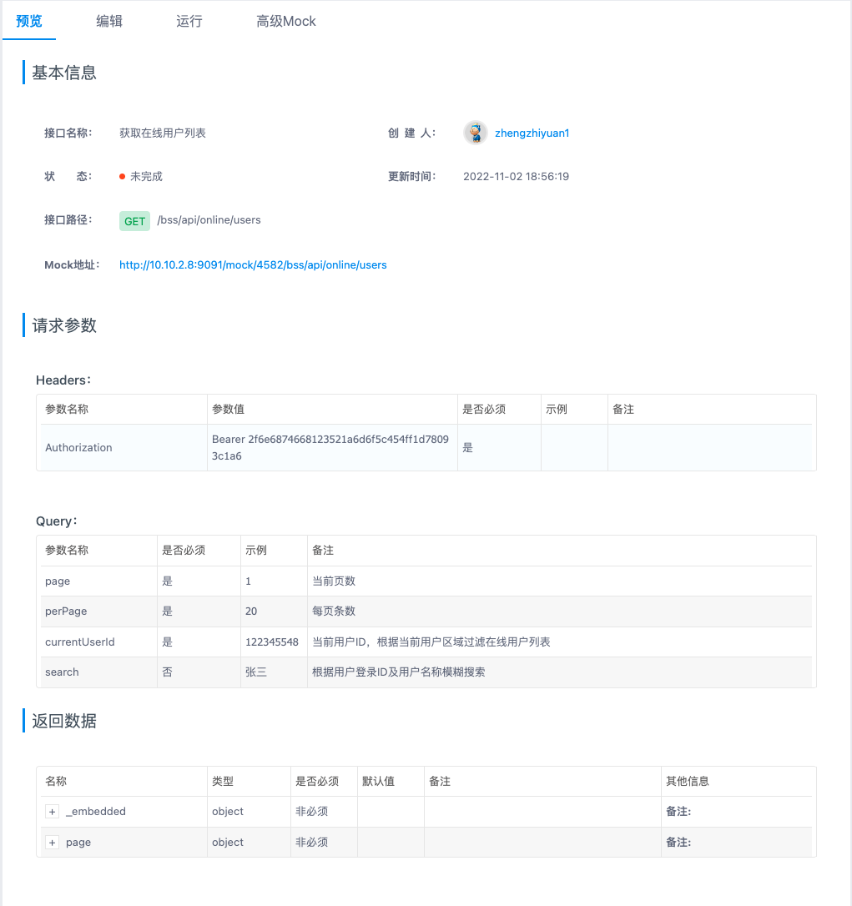

## [日志管理]() --何思婷/郑志远

### **功能简介**

- 日志管理功能以报表/图表形式,对于登录日志,操作日志,系统运行日志等信息进行监控管理

### **逻辑设计**

- 前端界面通过调用安全管理服务,对公告数据实现增删改查等操作.
- bff层根据使用场景,支持直接连接数据库,和第三方接口调用两种方式对数据进行操作.

### **功能详述及界面设计**

- 本系统监控首页,展示CPU、内存、服务器信息、磁盘状态
- 日志统计包含两部分数据展示功能:登录日志,对于用户登录信息进行统计展示;操作日志,对于用户操作信息进行统计展示
  
- 在线用户,统计当前登录系统的用户数量
  

### **程序说明**

- 界面通过调用service-security服务提供的rest接口完成对日志权限信息的操作.

### **性能,限制和约束**

- 点击查询.新增.修改.删除等操作界面呈现数据不得超过2s；
