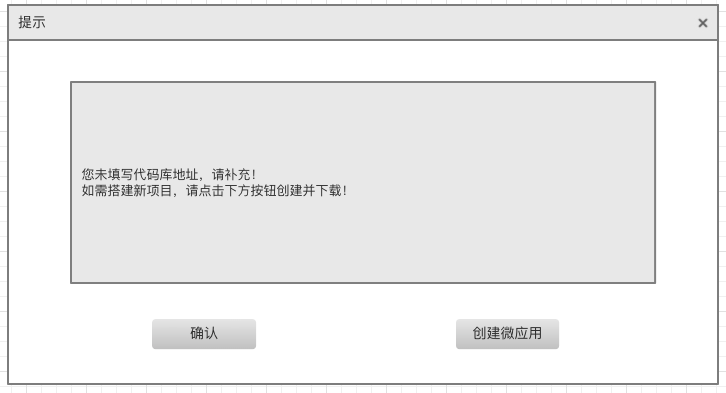

## [模块管理]()

### **功能简介**

- FeDX-framework框架允许系统管理员基于框架的基础能力通过模块管理功能管理微应用/微应用内路由,并结合版本管理及菜单管理进行功能发布
- 模块管理业务流程
  
- 模块管理功能模型
  
- 数据模型设计
--todo 待补充(接口设计)

### **逻辑设计**

- 前端界面通过调用模块管理服务,对模块(微应用)数据实现增删改查/路由发布管理操作.
- bff层对微应用相关数据进行操作.

### **功能及界面**

1.模块(微应用)列表
  列表字段:
    - id
    - 微应用名称(中文)--文本框搜索
    - 微应用代码库地址(可跳转)
    - 微应用模块名称(默认路由)--文本框搜索
    - 默认端口号--文本框搜索
    - 微应用分类(React/Vue)--选择框搜索
    - 所属行业--文本框搜索
    - 所属租户--文本框搜索
    - 创建/更新时记录时间
    - 微应用路由信息(下钻,已发布路由信息)
    - 版本信息管理(按钮下钻详情)

2.新增/修改/查看,基础信息在创建/新增时填写,除 微应用名称/微应用模块名称/默认端口号 外其他信息可修改;新增为维护已有模块信息,创建包括新模块微应用搭建;
  

- 表单字段:
        1. 微应用名称(中文)
        2. 微应用代码库地址(新增填写 不可为空,为空时,确认新增前弹出创建微应用提示)
        3. 微应用模块名称(默认路由)
        4. 默认端口号(单独建表,从现有分配情况同步后统一维护,本字段需要验证唯一性)
        5. 微应用分类(React/Vue)
        6. 所属行业（可为空,搜索用）
        7. 所属租户（可为空搜索用）
- 服务管理字段:
        1. id由接口层自动分配生成
        2. 创建/更新时记录时间
- 微应用代码库地址为空时,确认新增前,弹出提示框,历史项目需填写项目地址,新项目提示创建微应用模板并上传代码库;点击"创建微应用",后台使用脚手架搭建项目并下载;
    

3.删除-提示:不可删除,请联系管理员!

4.发布(路由发布):开发完成功能,路由仍存在项目内,此处需要自行填写发布路由信息,标示功能允许发布

- 发布(新增路由)表单字段:
        1. 路由名称(菜单名)
        2. path
        3. type
        4. params
        5. 所属模块(模块名称字段,不显示,关联数据用)
- 服务管理字段:
      1. id由接口层自动分配生成
      2. 创建/更新时记录时间
- 点击发布,储存数据
  
5.(下钻)微应用路由信息列表

  1. 路由名称(菜单名)
  2. path
  3. type
  4. params
  5. 所属模块(模块id,不显示,关联数据用)
  6. 生成菜单(按钮)
  7. 已关联菜单(菜单按钮反向查询--当前版本菜单path不允许重复)

6.版本管理
  1.微应用
  
  
--todo 插件功能整理补充(结合版本管理规划)

### **接口设计**

- 接口文档
  --todo(待补充)
- 界面通过调用service-security服务提供的rest接口完成对模块信息的操作.
  --todo(待补充)

## **性能,限制和约束**

- 点击查询,新增,修改,删除,发布等操作界面呈现数据不得超过2s；
