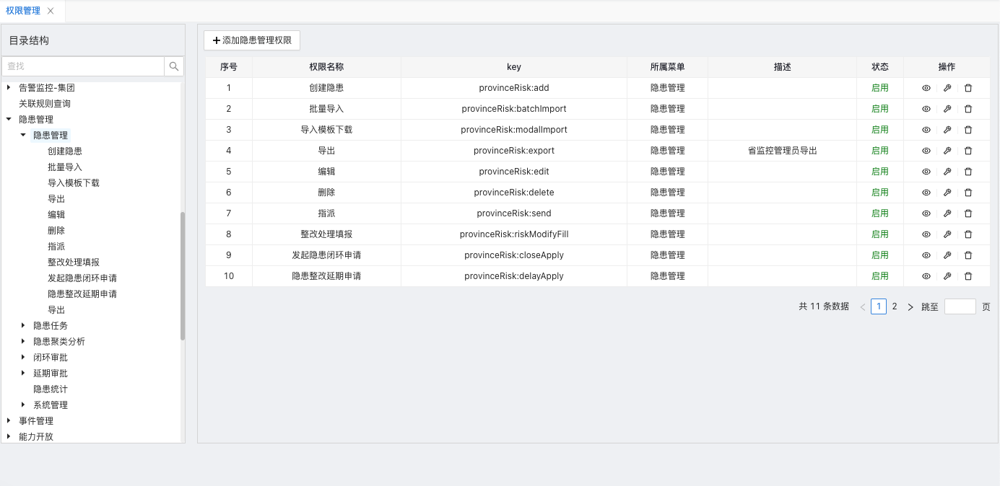
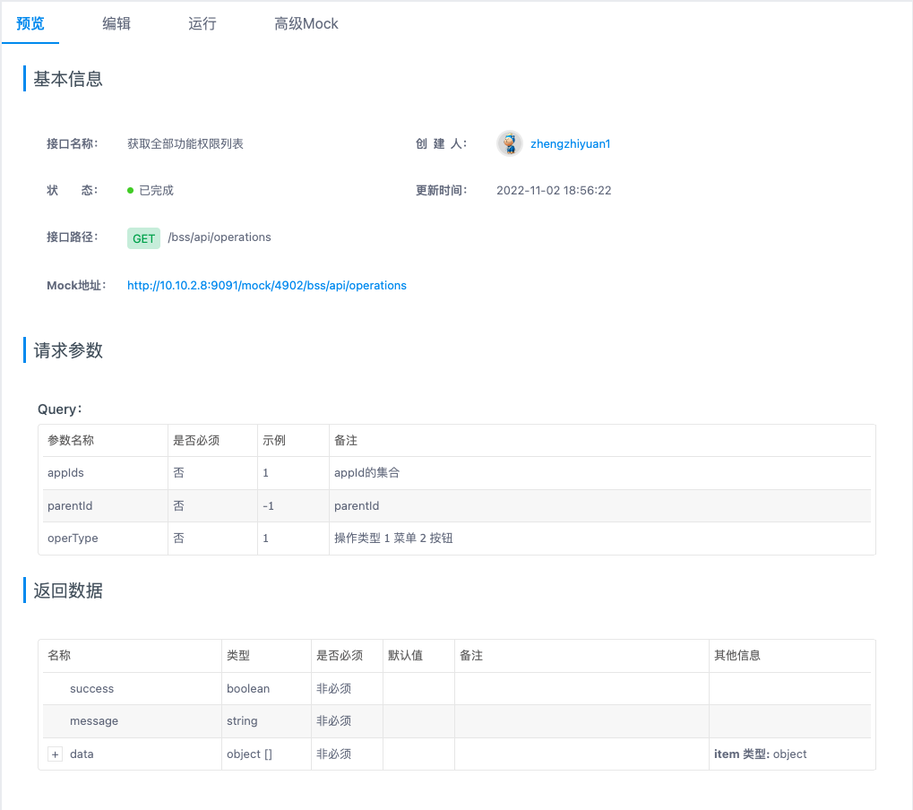
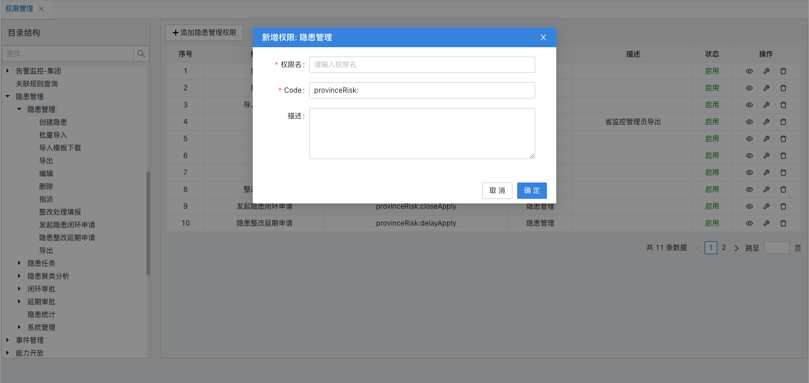
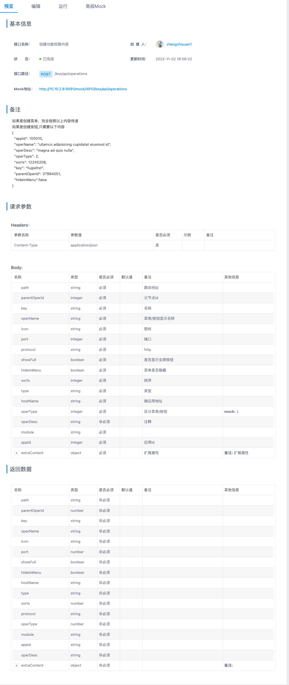
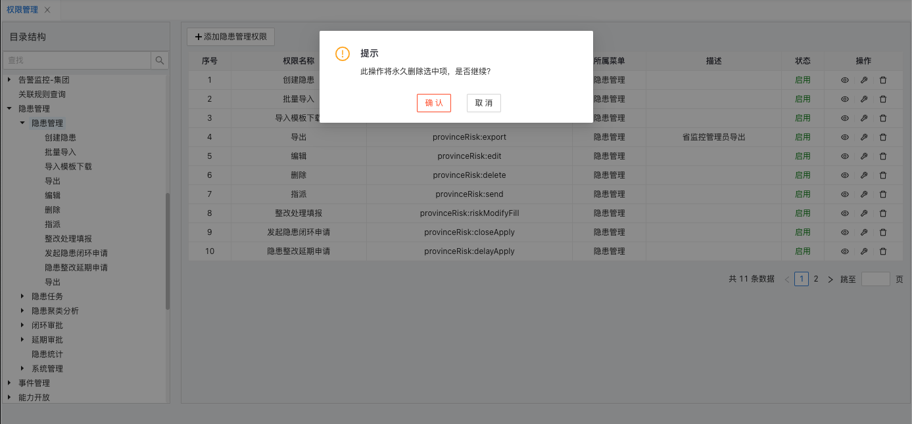
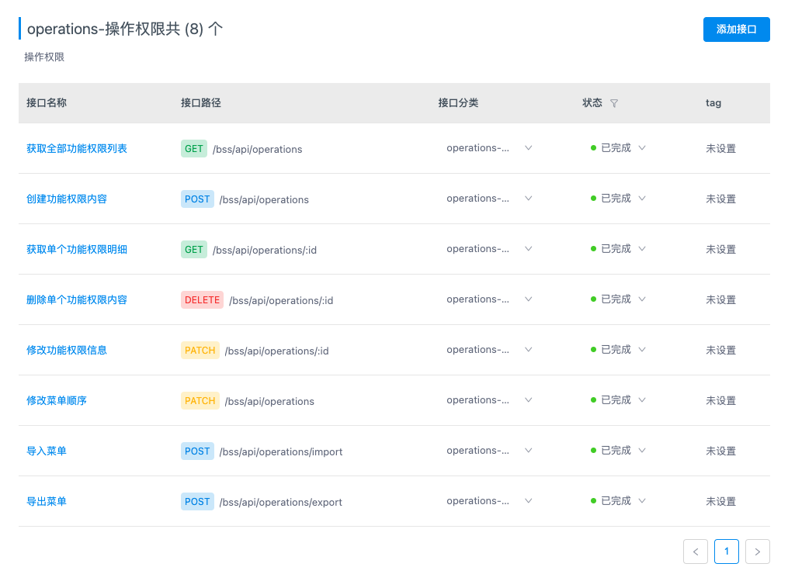

## [操作权限管理]()

### **功能简介**

- 操作权限基于菜单权限,以菜单下包含的操作按钮为粒度进行权限管理.

### **逻辑设计**

- 前端界面通过调用安全管理服务,对公告数据实现增删改查等操作.
- bff层根据使用场景,支持直接连接数据库,和第三方接口调用两种方式对数据进行操作.

### **功能详述及界面设计**

- 权限管理界面分为树图结构和子节点详情列表两部分;左侧树图展示包含上级菜单结构的权限数据结构,右侧展示数据列表.
  
  
- 右侧列表可对于选中父节点下的子菜单进行增删改
  
  
  
  

### **程序说明**

- 界面通过调用service-security服务提供的rest接口完成对操作权限信息的操作,具体属性参数在上一章节已做描述.
  

### **性能,限制和约束**

- 点击查询.新增.修改.删除等操作界面呈现数据不得超过2s；
