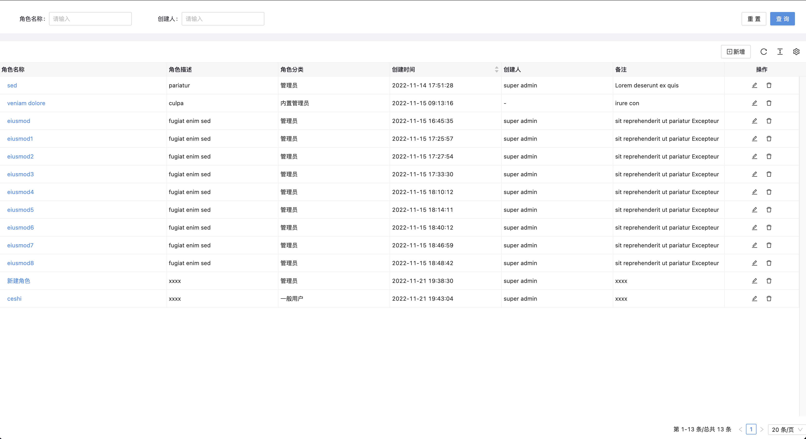
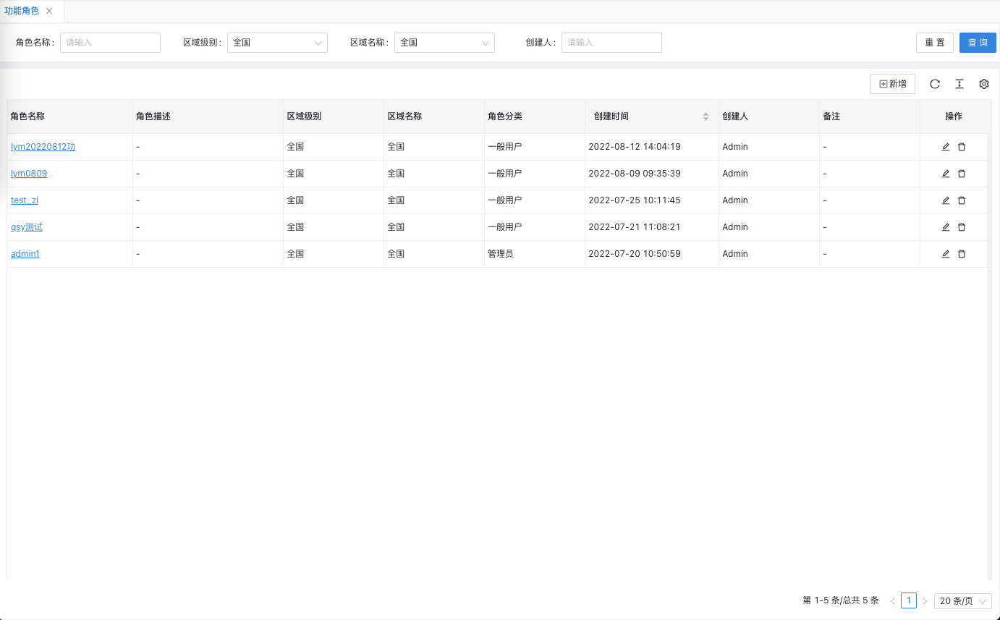
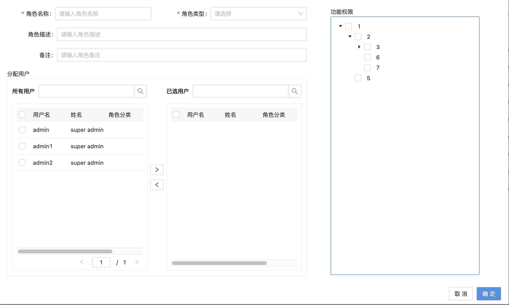
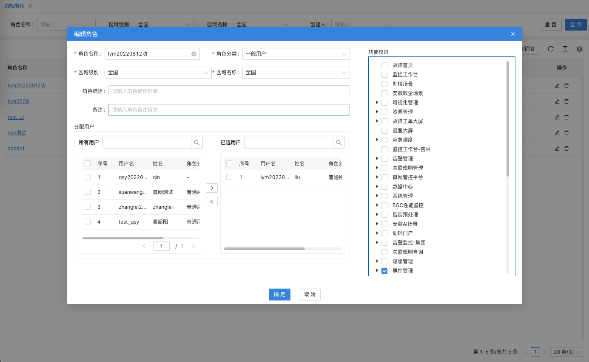
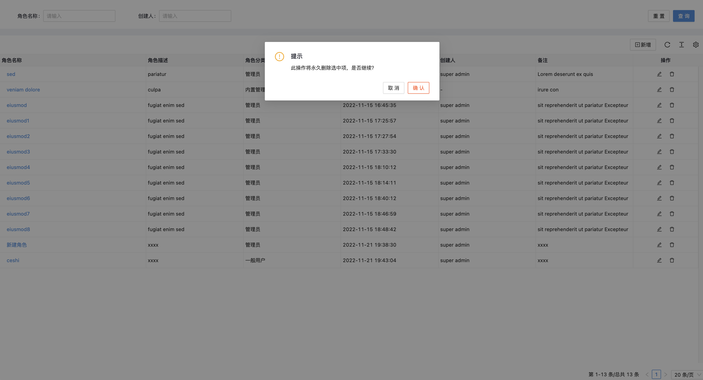
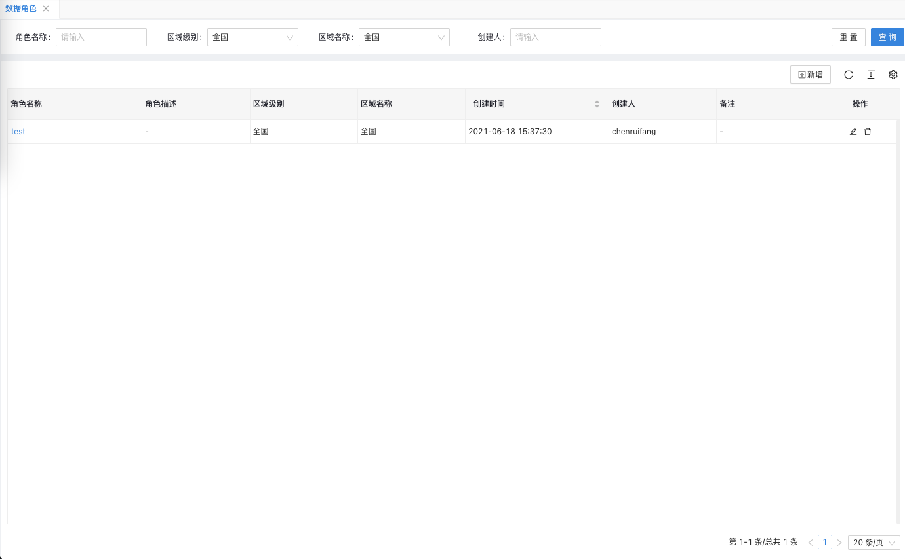
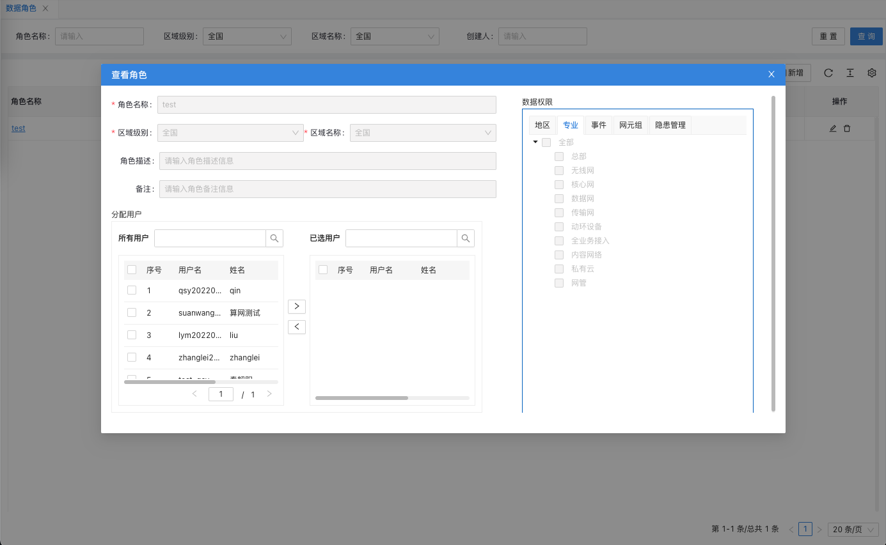
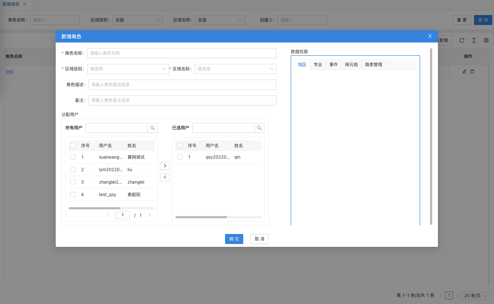
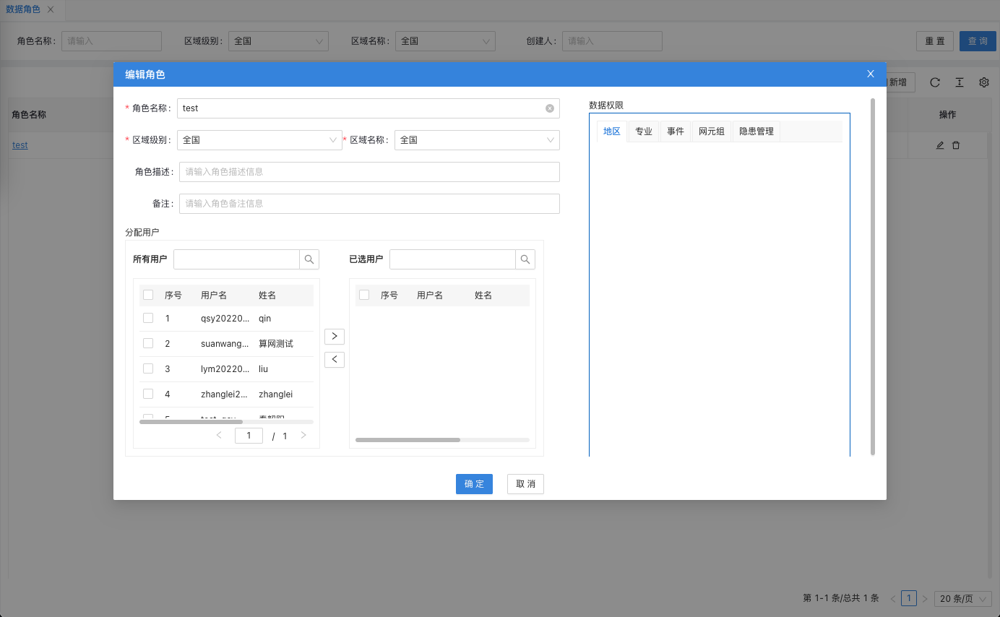
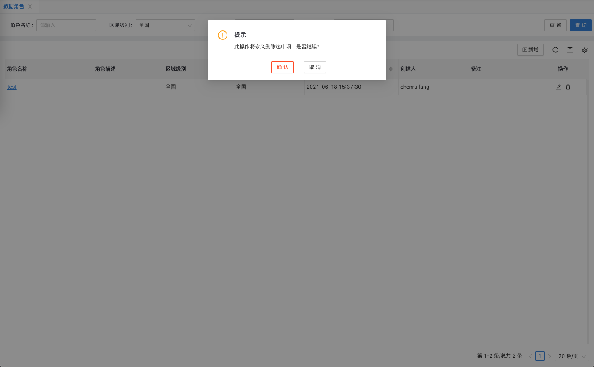

## [角色管理]()

### **功能简介**

- 角色管理界面可以对用户角色进行查询.新增.编辑.删除及关联用户操作。
- 角色信息分为:功能角色和数据角色两类.

### **逻辑设计**

- 前端界面通过调用安全管理服务,对公告数据实现增删改查等操作.
- bff层根据使用场景,支持直接连接数据库,和第三方接口调用两种方式对数据进行操作.

### **功能及界面**

#### **功能角色定义了登录用户的系统菜单访问权限范围**

- 功能角色管理列表支持按条件查询,单条信息支持查看详情
  
  

- 功能角色信息支持新增,新增角色信息可关联用户信息
  

- 功能角色信息支持单条修改
  

- 功能角色信息支持单条删除,删除角色前会对数据进行校验,已经关联用户的角色信息不允许删除
  
  

#### **数据角色定义了登录用户的数据访问权限范围,基础能力支持按照区域级别分配数据权限,功能支持扩展**

- 数据角色管理列表支持按条件查询,单条信息支持查看详情
  
  

- 数据角色信息支持新增,新增角色信息可关联用户信息
  

- 数据角色信息支持单条修改
  

- 数据角色信息支持单条删除,删除角色前会对数据进行校验,已经关联用户的角色信息不允许删除
  
  

### **接口设计**

- 接口文档:<http://10.10.2.8:9091/project/255/interface/api/cat_1103>
- 界面通过调用service-security服务提供的rest接口完成对角色信息的操作,具体接口调用在上一章节已做描述.
  

### **性能,限制和约束**

- 点击查询.新增.修改.删除等操作界面呈现数据不得超过2s；
  