## [用户管理]()

### **功能简介**

- 用户管理界面可以对用户信息进行查询.新增.编辑.删除操作。
- 用户信息包含：用户名,登录ID,用户ID,密码,,账号状态等基本信息，以及用户与部门/角色的归属关系。

### **逻辑设计**

- 前端界面通过调用安全管理服务,对公告数据实现增删改查等操作.
- bff层根据使用场景,支持直接连接数据库,和第三方接口调用两种方式对数据进行操作.

### **功能详述及界面设计**

- 用户管理列表支持按登录ID,姓名,状态,部门等条件查询,单条信息支持查看详情
  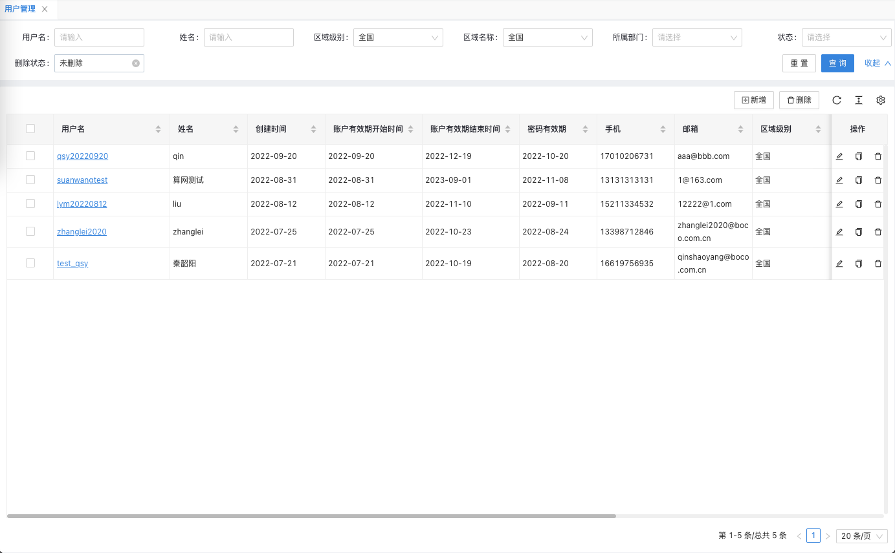
  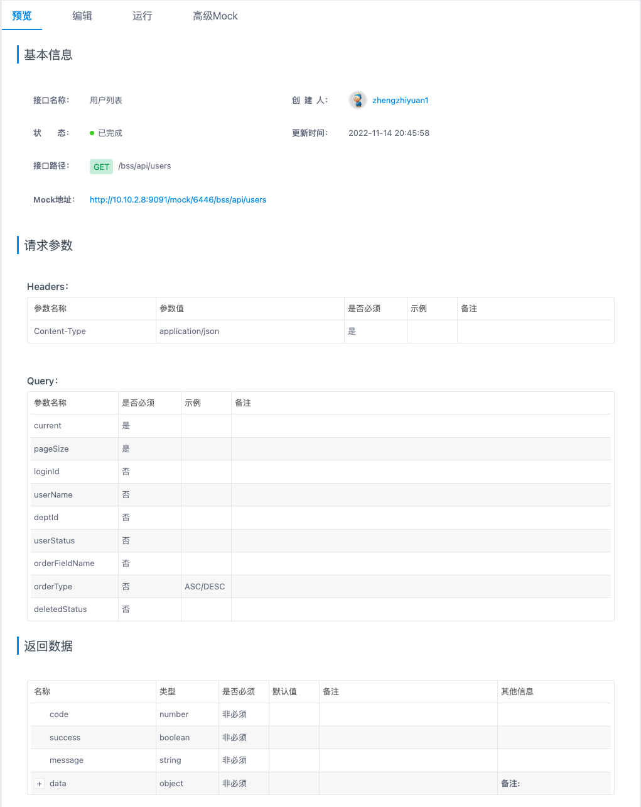
  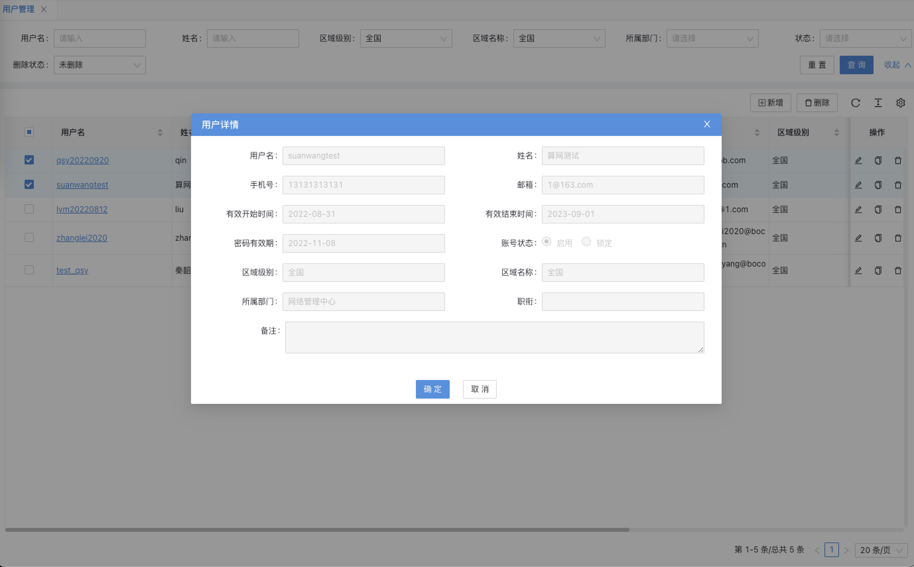
  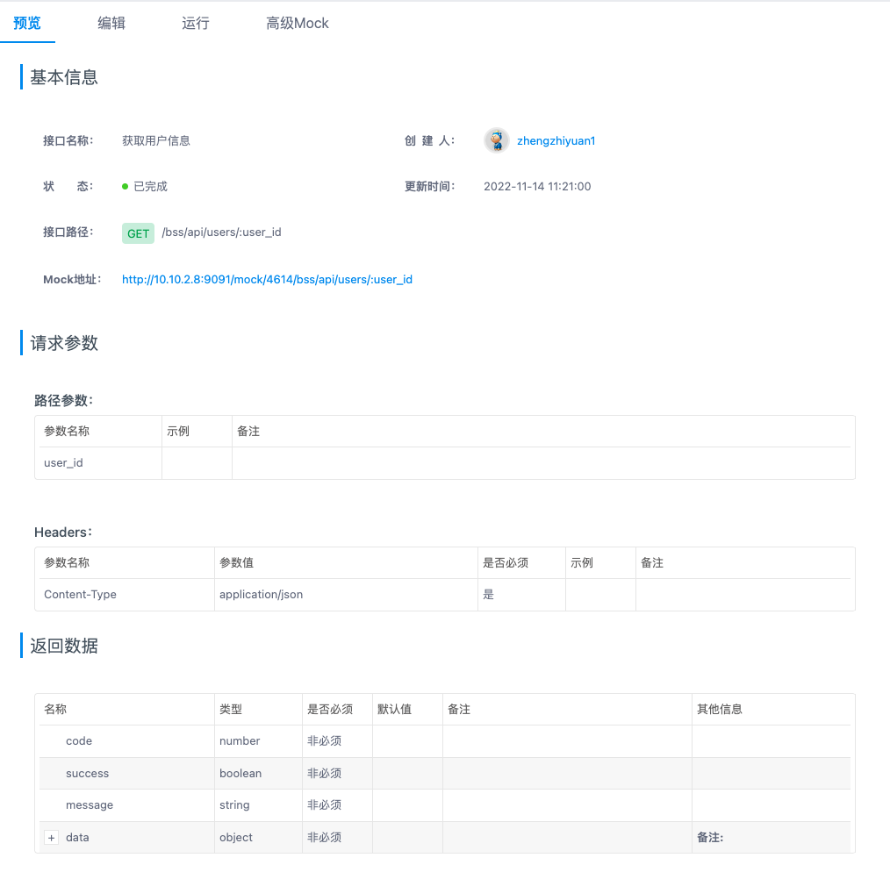
- 用户信息支持新增,新增用户可关联部门信息
  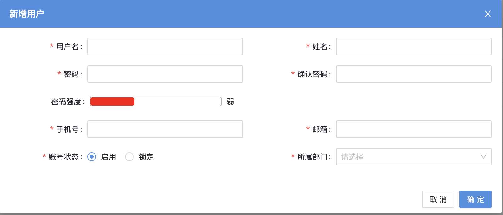
  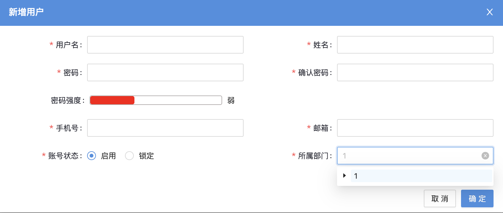
  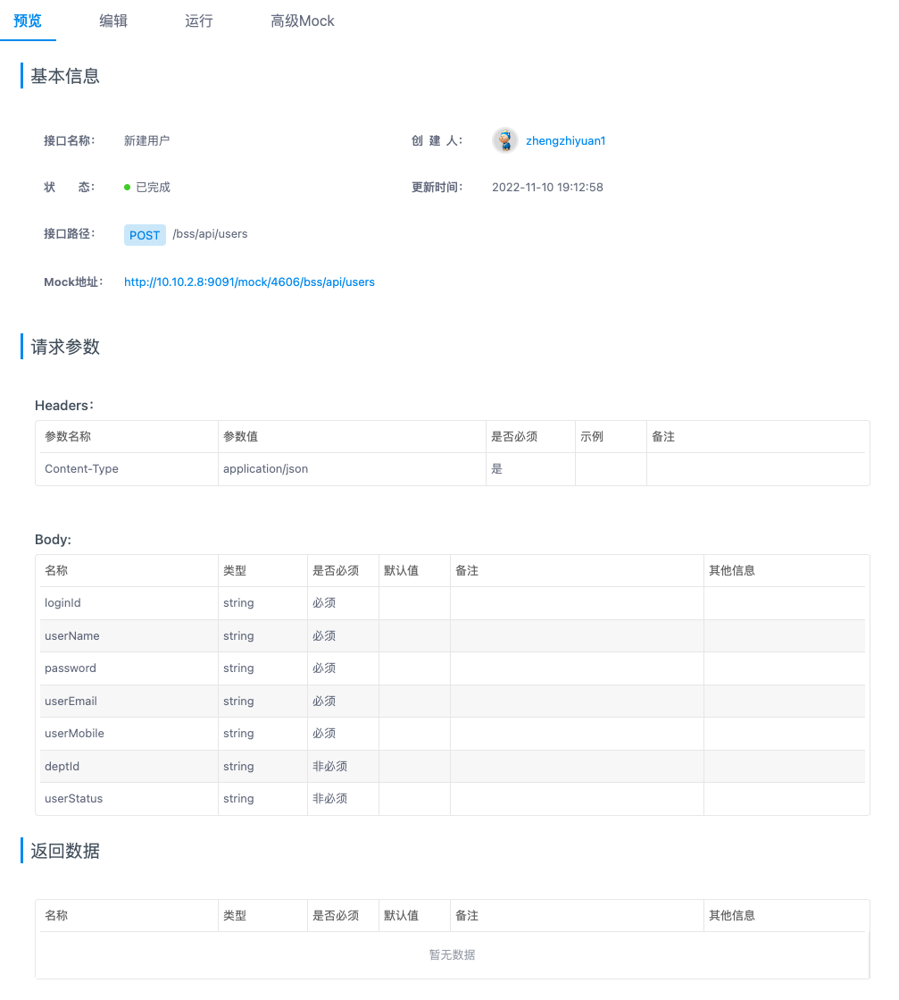
- 用户信息支持单条修改
  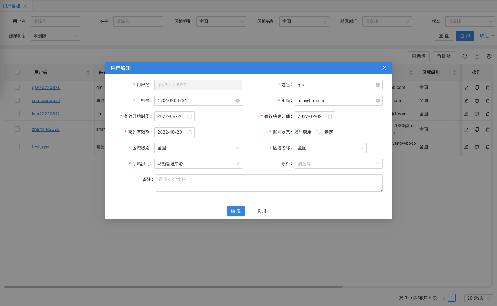
  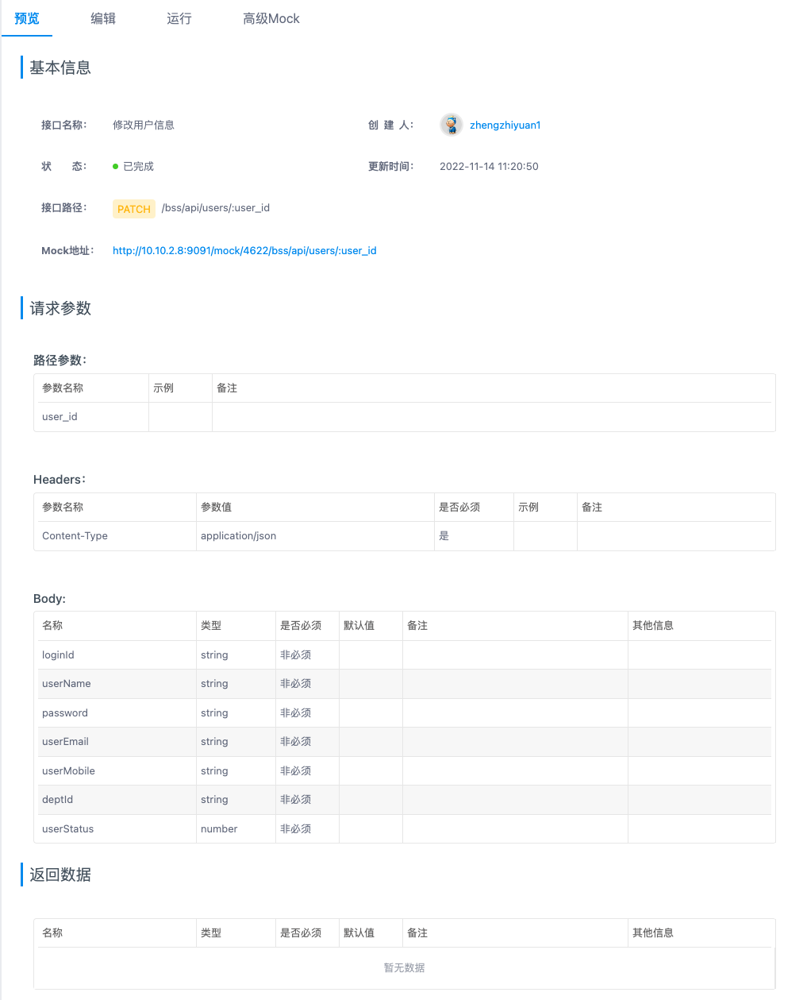
- 用户信息支持单条/批量删除
  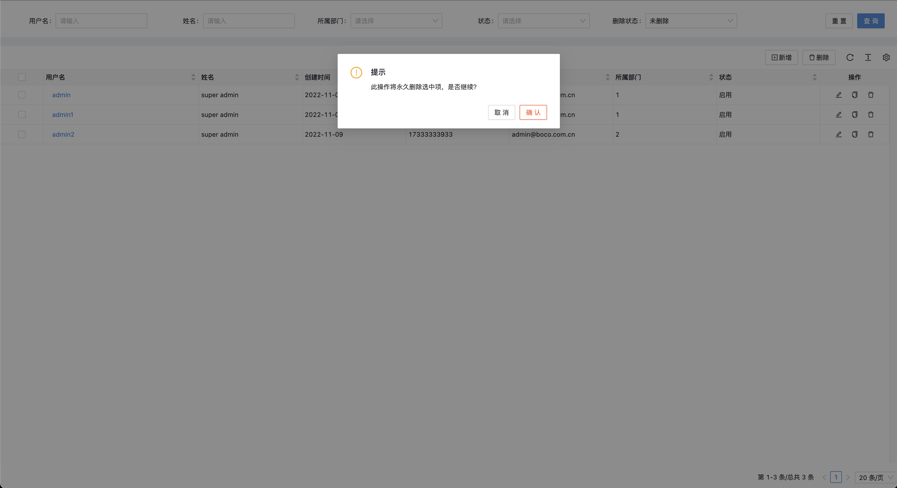
  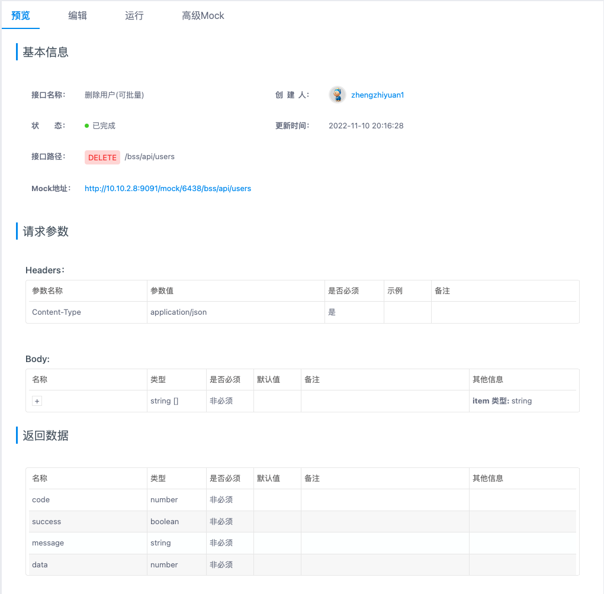

### **程序说明**

- 界面通过调用service-security服务提供的rest接口完成对用户信息的操作,具体接口调用在上一章节已做描述.
  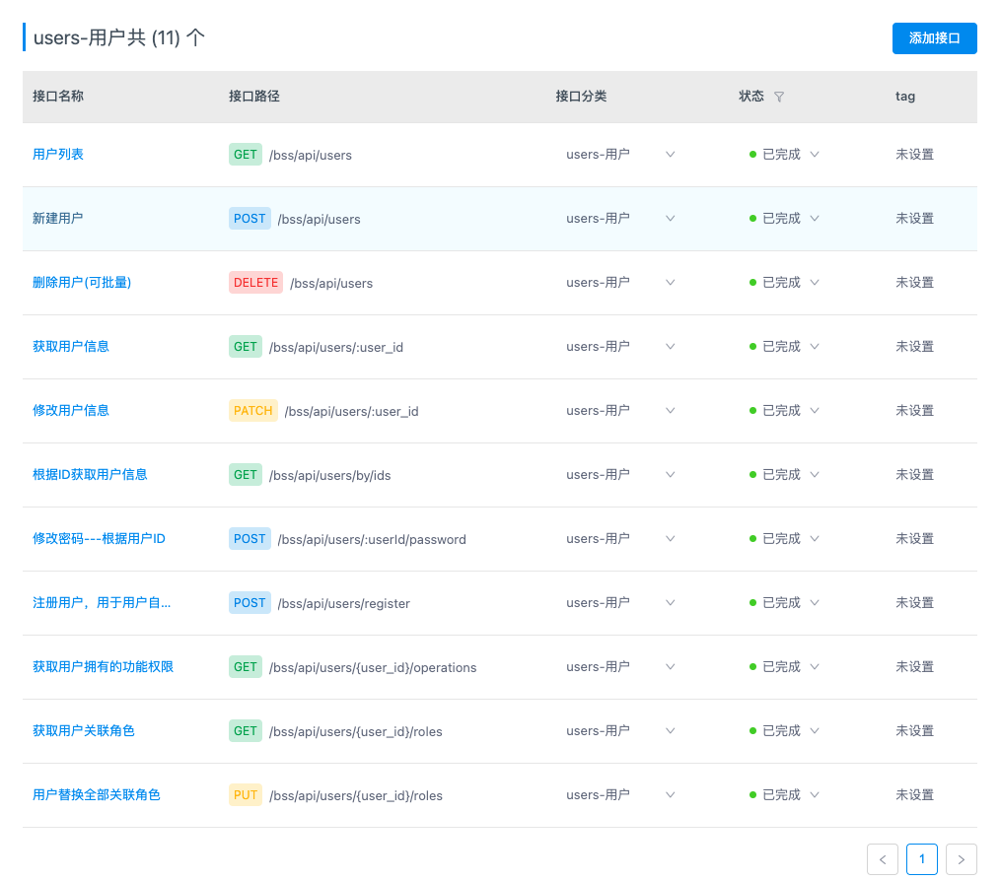

### **性能,限制和约束**

- 点击查询.新增.修改.删除等操作界面呈现数据不得超过2s；
