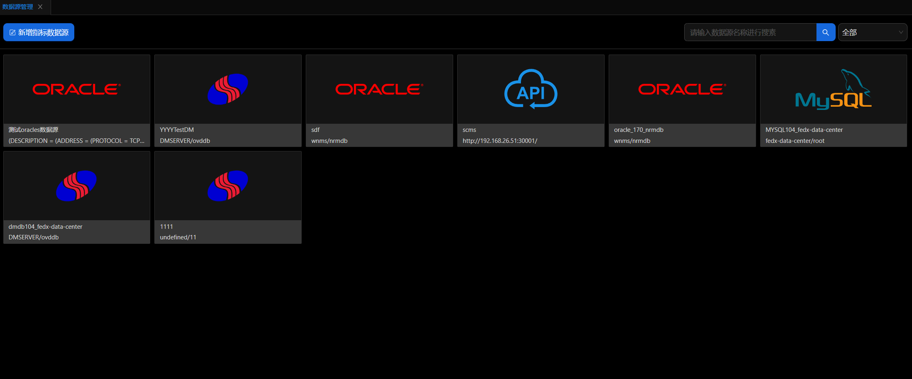
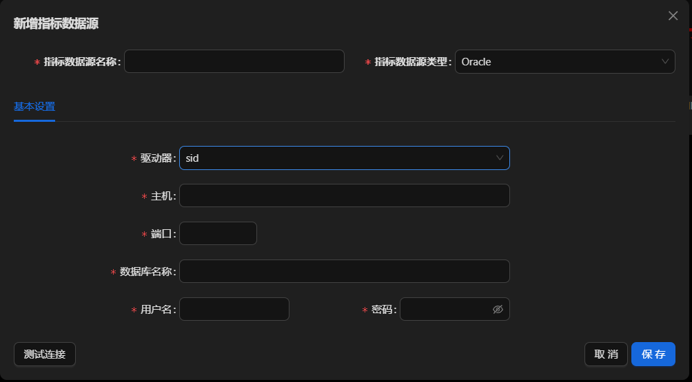
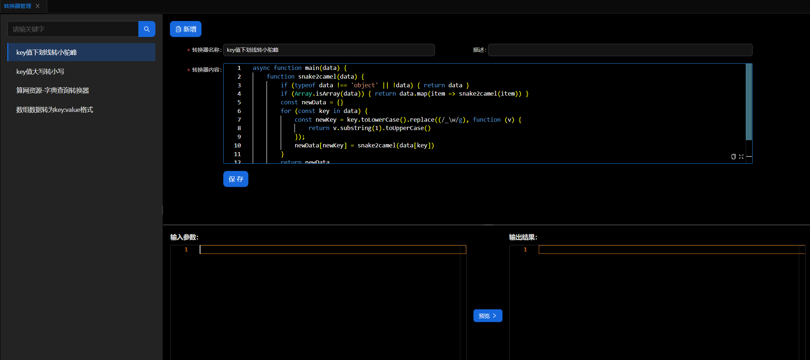
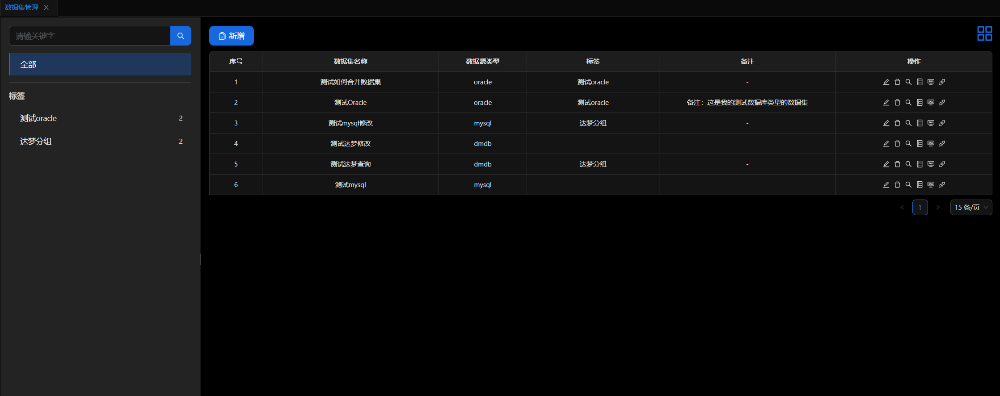
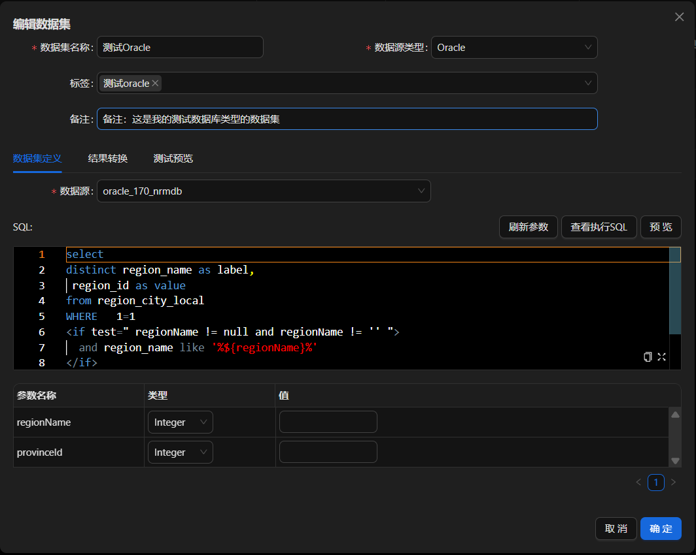
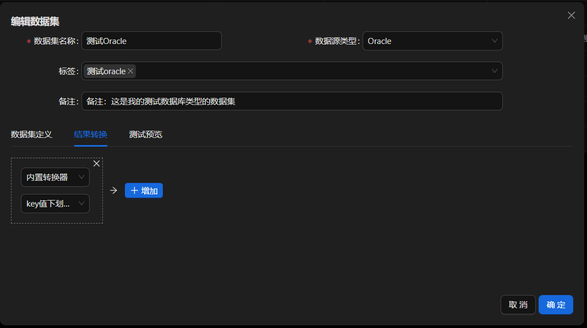
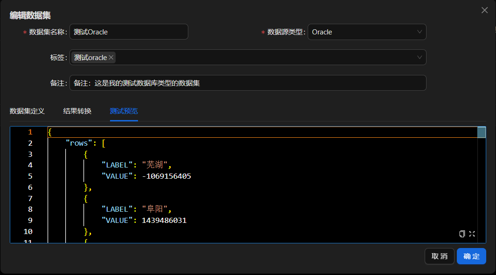
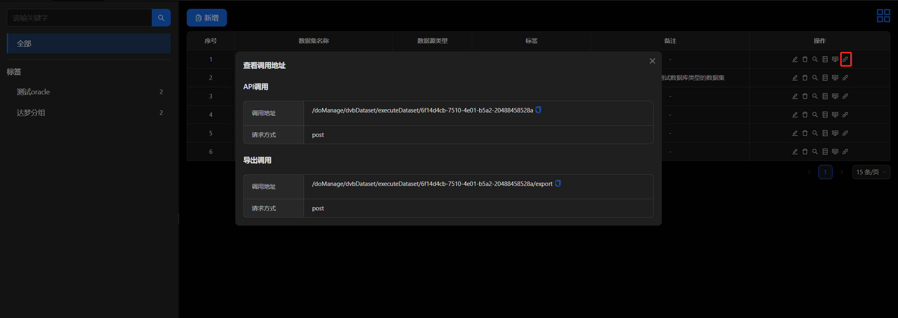

## **数据中心**

### **基本概念**

数据中心是新 Web 应用接受外部数据，并转化为可适配的数据的关键节点。驱动新 Web 应用的数据必须经过数据中心的转化，方可被使用。数据中心并不存储输入的数据，数据仍将存储在其原始位置上。数据中心的核心功能是描述所数据的数据，使其在结构上可以被新 Web 应用所理解。数据中心的核心概念包括：数据源，数据集，转换器

### **菜单组成**

数据中心包括以下三个菜单：数据源，数据集，转换器

### **数据源**

顾名思义数据的来源，可以是数据库，可以是其他接口。目前支持 Oracle，Mysql，Dmdb 数据库。

#### 数据源列表

打开数据源页面，左上角为新建数据源按钮。点击创建一个数据源，操作步骤参考下图：

通过选择数据源类型，填入对应的信息，点击确定即可完成创建。目前支持 Oracle，Mysql，Dmdb 数据库，与 Rest 请求。信息填写完成后，允许对数据源进行测试。提醒：连接数据库与 Api 调用都是通过服务端进行，所以服务端网络必须与数据源网络互通。

### **转换器**

此转换器是内置转换器，内置转换器是为针对大部分数据集使用相同转换器，进行统一管理，不需要用户自己重新编写。

#### 内置转换器

左侧为内置转换器列表，右侧为转换器编辑页面，点击新增，可对转换器进行新增，点击保存，完成转换器编辑。右侧下方为转换器的入参，右侧为出参，点击预览。可对转换器进行测试，转换器根据左侧的输入参数进行转换的执行操作，测试结果将在右侧展示。

### **数据集**

通过已建立的数据源，进行数据查询，数据查询支持可视化编辑自定义 SQL，静态文件，Api，转换器操作，最终生成客户需要的数据集。在使用数据集的时候，当通过 SQL 直接查询返回的数据，无法满足使用要求时，可通过自定义转换器或内置转换进行 js 编写，实现数据裁剪，合并，最终生成客户需要的数据。

#### 数据集列表

打开数据集页面，左侧为标签列表，右侧为数据集列表，每个数据集可归属多个标签，用户可通过标签或查询对数据集列表就行筛选：

#### 创建/编辑 数据集

点击新建数据集，进入数据集编辑页面，输入本次新建的数据集名称，选择数据源类型，数据源列表将根据数据源类型呈现，输入需要查询的 SQL。支持 mybatis 格式的 sql 输入，点击预览，可查看当前 sql 的查询结果。点击确定，完成数据集创建。
操作步骤参考下图：

结果转换:允许用户进行内置转换器选择或自定义转换器编辑，每新增一个转换器，均可点击测试预览，对结果进行确认，以达到用户所需结果的格式。

### **使用流程**

- 数据集完成后，如何使用:
  每个数据集都有一个调用地址，可通过调用地址获取数据。点击下图中的按钮，会弹出调用地址，点击复制，即可在代码中使用。参数为查询参数，返回值为查询结果。
  
